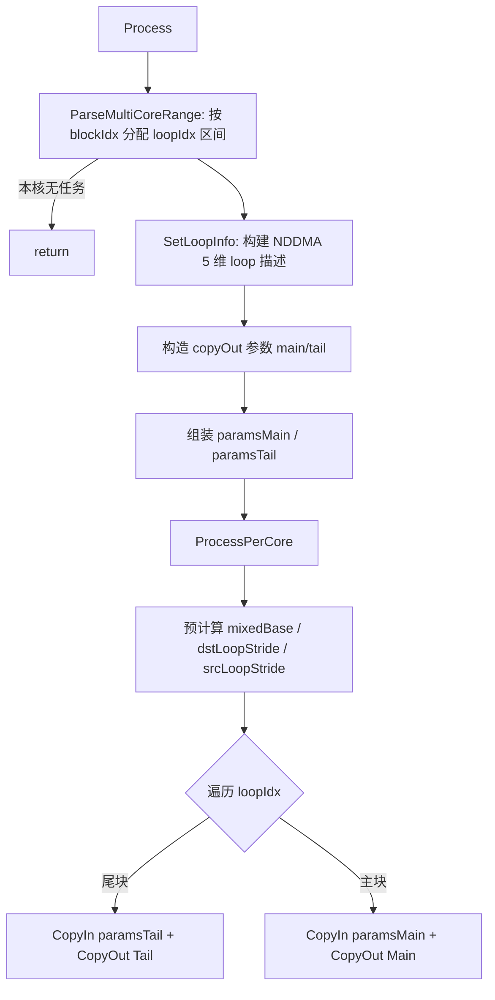

# Transpose 性能调优参考:BIG_DIM(高维转置)

- 策略名:BIG_DIM(高维转置)
- tilingKey:10005(`transpose_kernel.cpp` 中宏 `BIG_DIM 10005`)
- kernel 实现:`arch35/transpose_big_dim.h`,类 `TransposeBigDim`
- host 选择/切分:`transpose_tiling.cpp` 中 `EntryTilingTemplate`、`DoSplitUBBigDim`、`FlushBaseNumForBigDim`、`CalcBlockSplitInfoForBigDim`

本文面向性能调优开发者,内容以上述代码为准。

---

## 一、适用场景

### 为什么需要专门的高维策略

其它 NDDMA 系列策略(NDDMA_BASE、CUT_ONCE、CUT_TWICE 等)依赖硬件 NDDMA(N 维 DMA)搬运指令,一次搬运能描述的维数受硬件上限约束。代码中该上限为常量:

```cpp
// transpose_base.h
constexpr int64_t NDDMA_MAX_DIM_NUM = 5;   // NDDMA 一次最多描述 5 维
```

kernel 侧的多维搬运参数结构也被固定成 `NDDMA_MAX_DIM_NUM` 维:`MultiCopyLoopInfo<NDDMA_MAX_DIM_NUM>`、`MultiCopyParams<T, NDDMA_MAX_DIM_NUM>`。也就是说,一条 NDDMA 指令的 loop 描述最多只有 5 个维度(loopSize / src stride / dst stride)。

当算子的 reduce 之后维度(`shapeInfo_.dim`)超过 5 时,无法用一条 NDDMA 指令覆盖全部维度。`EntryTilingTemplate` 中的分派逻辑正是据此选择:

```cpp
// transpose_tiling.cpp EntryTilingTemplate()
if (shapeInfo_.dim <= NDDMA_MAX_DIM_NUM) {
    tilingKey_ = KEY_NDDMA_BASE;   // <=5 维,单指令可覆盖
} else {
    tilingKey_ = KEY_BIG_DIM;      // >5 维,走高维专用策略
}
```

前置条件:只有当总数据量达到阈值(`totalVolumeActual * eleLenInBytes >= SMALL_SHAPE_BYTES_THRES_HOLD`)且不满足 N_LAST 特例时,`dim > 5` 才会落到 BIG_DIM;否则走 SMALL_SHAPE 等策略。

### 它解决什么问题

BIG_DIM 解决的核心问题是:**维数超过 NDDMA 硬件上限(5)时,如何仍然用 NDDMA 高效完成任意 perm 的转置**。

思路是把高维转置拆成两层:

1. **外层软件循环(host + kernel 协同)**:把「不进 NDDMA 的那些维度」以及被切分维度的分块,折叠成一个一维的 `loopIdx` 计数,由多核和 kernel 内循环遍历。每个 `loopIdx` 对应一次 NDDMA 搬运。
2. **内层 NDDMA 硬件搬运**:每个 `loopIdx` 内,用一条最多 5 维的 NDDMA 指令搬运一块连续/带 stride 的子张量,由硬件完成这 5 维范围内的重排。

### 为什么能提升性能

- 内层仍然使用 NDDMA 硬件多维搬运,享受硬件带 stride 的多维搬运能力,避免退化为逐元素 gather/标量搬运。
- 外层把无法放进 NDDMA 的维度折叠成一维 `loopIdx`,天然可按 `loopIdx` 做多核均分(`CalcBlockSplitInfoForBigDim` + `ParseMultiCoreRange`),核间负载均衡。
- UB 分块因子(`outUbFactor`)在 host 侧按 UB 容量和核数联合寻优,尽量让核用满(`VEC_CORE_USED_THRES_HOLD`),兼顾单次搬运粒度与并行度。

---

## 二、kernel 执行流程与关键实现

### 维度映射:哪 5 维进 NDDMA(host `FlushBaseNumForBigDim`)

host 侧需要从 >5 维中,挑出「最内侧的、连续的」维度交给 NDDMA。按输出维序从最内(`dim-1`)向外遍历,填充 `nddmaIdx_`(记录进 NDDMA 的是原 perm 的哪个轴)与 `baseNddmaShape_`(该轴在 NDDMA 输出内的 stride 基数),同时累计 `totalNddmaNum_`(一次 NDDMA 搬运的元素总量):

```cpp
// transpose_tiling.cpp FlushBaseNumForBigDim() 关键片段
for (int64_t i = shapeInfo_.dim - 1; i >= 0; i--) {
    baseInShape_[i] = baseInNum;
    baseInNum *= shapeInfo_.reducedInShape[i];
    if (i > splitInfo_.outCutIndex) {          // 切分点更内侧:整轴进 NDDMA
        nddmaIdx_[idxNum] = shapeInfo_.reducedPerm[i];
        tmpNddmaShape[idxNum] = totalNddmaNum_;
        totalNddmaNum_ *= shapeInfo_.reducedOutShape[i];
        idxNum--;
    } else if (i == splitInfo_.outCutIndex) {  // 切分轴:只进 outUbFactor 份
        nddmaIdx_[idxNum] = shapeInfo_.reducedPerm[i];
        tmpNddmaShape[idxNum] = totalNddmaNum_;
        totalNddmaNum_ *= splitInfo_.outUbFactor;
        idxNum--;
    } else if (idxNum >= 0) {                   // 切分点外侧:折叠到外层 loopIdx
        nddmaIdx_[idxNum] = shapeInfo_.reducedPerm[i];
        tmpNddmaShape[idxNum] = totalNddmaNum_;
        idxNum--;
    }
}
std::sort(std::begin(nddmaIdx_), std::end(nddmaIdx_));  // 按原始轴号排序
// 排序后重建 baseNddmaShape_ 与 nddmaIdx_ 的对应关系
```

要点:
- `outCutIndex`(输出切分轴)以内的维度整轴进 NDDMA;切分轴本身只取 `outUbFactor` 份进 NDDMA;更外侧维度不进 NDDMA,交给外层 `loopIdx`。
- `nddmaIdx_` 最终经 `std::sort` 排序,`baseNddmaShape_` 随之重排,使 NDDMA 内部按输入侧轴序索引一致。
- UB 分块由 `DoSplitUBBigDim` 决定:从最内维往外找,直到 `ubElement < reducedOutShape[i]` 或剩余可用 NDDMA 维数(`dimSize`,初始 `NDDMA_MAX_DIM_NUM-1`)耗尽,确定 `outCutIndex / outUbFactor / outTailFactor`。

### Init

```cpp
// transpose_big_dim.h
void Init(...) {
    blockIdx_ = GetBlockIdx();
    tiling_ = tilingData;
    inputGM_.SetGlobalBuffer((__gm__ T*)x);
    outputGM_.SetGlobalBuffer((__gm__ T*)y);
    pipe->InitBuffer(vecQue_, 1, tiling_->ubSize);   // 单块 UB
}
```

注意:`vecQue_` 使用 `TQueBind<VECIN, VECOUT, 1>`,buffer 深度为 1(单缓冲,in/out 复用同一块 UB),本策略未使用 double buffer。

### Process 主流程



多核切分:`ParseMultiCoreRange`(在 `transpose_base.h`)根据 `realCoreNum / blkFactor / blkTailFactor` 把外层 `loopIdx` 空间均分给各核,返回本核区间 `[blkProcessIdxStart_, blkProcessIdxEnd_)`;`blockIdx_ >= realCoreNum` 的核直接返回不参与。

### SetLoopInfo:构建 NDDMA 5 维搬运描述

为每个 NDDMA 维打标 `nddmaFlag`,区分三类:

- `== -1`:该 NDDMA 轴正好是被切分的输出轴(`perm[outCutIndex]`)→ loopSize 取 `outUbFactor`,记录 `cutIdx_`。
- `== 1`:该轴位于切分点之后(属于 NDDMA 内部整搬运的轴)→ loopSize 取输入 shape,src stride 取 `baseInShape`,dst stride 取 `baseNddmaShape`。
- 其它:loopSize=1,仅带 dst stride。

```cpp
// transpose_big_dim.h SetLoopInfo() 核心分支
if (nddmaFlag[...] == 1) {
    loopInfo.loopSize[i]      = tiling_->inputShape[nddmaIdx];
    loopInfo.loopSrcStride[i] = tiling_->baseInShape[nddmaIdx];
    loopInfo.loopDstStride[i] = tiling_->baseNddmaShape[...];
} else if (nddmaFlag[...] == -1) {
    cutIdx_ = i;
    loopInfo.loopSize[i]      = tiling_->outUbFactor;
    loopInfo.loopSrcStride[i] = tiling_->baseInShape[nddmaIdx];
    loopInfo.loopDstStride[i] = tiling_->baseNddmaShape[...];
} else {
    loopInfo.loopSize[i] = 1; loopInfo.loopSrcStride[i] = 1;
    loopInfo.loopDstStride[i] = tiling_->baseNddmaShape[...];
}
```

`loopLpSize/loopRpSize`(左右 pad)全部置 0,本策略不做 padding。

### 主块 / 尾块

`outCutIndex` 轴被 `outUbFactor` 切分,末尾可能剩余 `outTailFactor` 份:

```cpp
copyOutParamsMain.blockLen = tiling_->totalNddmaNum * sizeof(T);
copyOutParamsTail.blockLen =
    tiling_->totalNddmaNum / tiling_->outUbFactor * tiling_->outTailFactor * sizeof(T);
// 尾块把 cutIdx_ 维的 loopSize 改成 outTailFactor
if (tiling_->outTailFactor != 0) {
    loopInfo.loopSize[cutIdx_] = tiling_->outTailFactor;
}
```

`ProcessPerCore` 中判定:当 `outTailFactor != 0` 且 `(loopIdx+1) % outCutLoopSize == 0` 时走尾块参数,否则走主块。`outCutLoopSize = CeilDiv(outputShape[outCutIndex], outUbFactor)`。

### 索引映射:loopIdx → 混合进制 → GM 地址(CopyIn/CopyOut)

外层 `loopIdx` 是把「切分轴的分块 + 切分点外侧各维」折叠成的一维计数。`ProcessPerCore` 先预计算每一位的进制 `dstAddressOffsetMixedBase_` 与各维步长 `dstLoopStride_ / srcLoopStride_`:

```cpp
// 逐维累乘构造 stride,切分轴步长再乘 outUbFactor
if (i >= 1) {
    dstLoopStride_[i] = dstLoopStride_[i-1] * tiling_->outputShape[permSize - i];
    srcLoopStride_[i] = srcLoopStride_[i-1] * tiling_->inputShape[permSize - i];
}
dstLoopStride_[permSize-1-outCutIndex]           *= outUbFactor;
srcLoopStride_[permSize-1-perm[outCutIndex]]     *= outUbFactor;
```

`DecimalToMixed` 把一维 `loopIdx` 按混合进制展开成各维坐标 `dstAddressOffsetMixedBaseRes_`(十进制 → 混合进制转换):

```cpp
void DecimalToMixed(int64_t num, int64_t bases[], int64_t mixedBase[]) {
    for (int64_t i = 0; i < permSize; i++) {
        mixedBase[i] = num % bases[i];
        num /= bases[i];
        if (num == 0) break;
    }
}
```

- CopyIn:用 perm 把输出坐标映射回输入坐标,累加得 `srcAddressOffset`,再发 NDDMA `DataCopy<T, NDDMA_MAX_DIM_NUM, config>` 把子张量搬进 UB。
- CopyOut:直接用输出坐标累加 `dstAddressOffset`,`DataCopyPad` 把 UB 结果写回 `outputGM_`。

```cpp
// CopyIn:输出坐标 -> 输入偏移(perm 逆映射)
srcAddressOffset += dstAddressOffsetMixedBaseRes_[i] *
                    srcLoopStride_[permSize - 1 - perm[permSize - 1 - i]];
// CopyOut:输出坐标 -> 输出偏移
dstAddressOffset += dstAddressOffsetMixedBaseRes_[i] * dstLoopStride_[i];
```

维度重排本身由内层 NDDMA 依据 `loopSrcStride/loopDstStride`(源按输入布局带 stride 读、目的按 NDDMA 连续布局写)完成;外层负责把「装不进 NDDMA 的高维」逐块定位到正确 GM 地址。

### 关键技术小结(按代码实际)

- **NDDMA 多维搬运**:内层 `DataCopy<T, NDDMA_MAX_DIM_NUM, config>` + `DataCopyPad`,一次最多 5 维带 stride 搬运,完成 NDDMA 范围内的重排。
- **维度折叠 + 混合进制索引**:`FlushBaseNumForBigDim`(host)划定进 NDDMA 的维度,`DecimalToMixed`(kernel)把外层一维 `loopIdx` 还原为多维坐标,突破 5 维硬件上限。
- **多核切分**:按外层 `loopIdx` 空间用 `ParseMultiCoreRange` 均分,`CalcBlockSplitInfoForBigDim` 在 host 按核数寻优 `outUbFactor`(阈值 `VEC_CORE_USED_THRES_HOLD`)。
- **主/尾块处理**:切分轴非整除时用 `outTailFactor` 单独构造 tail 参数。
- **UB 缓冲**:单块 UB(`InitBuffer(vecQue_, 1, ubSize)`),in/out 复用,**未使用 double buffer**。

---

## 调优提示

- 若观察到核利用率不足,关注 host 侧 `outUbFactor` 是否被 `VEC_CORE_USED_THRES_HOLD` 逻辑压小以换取更多并行块;单块搬运粒度(`totalNddmaNum`)过小会拉低 NDDMA 效率。
- BIG_DIM 单缓冲、无 double buffer,搬入搬出串行;其性能主要取决于每块 NDDMA 的连续度与多核均衡,而非流水掩盖。
- 维数恰为 5 时不会进入 BIG_DIM(走 NDDMA_BASE);只有 reduce 后维度 > 5 才触发本策略。
