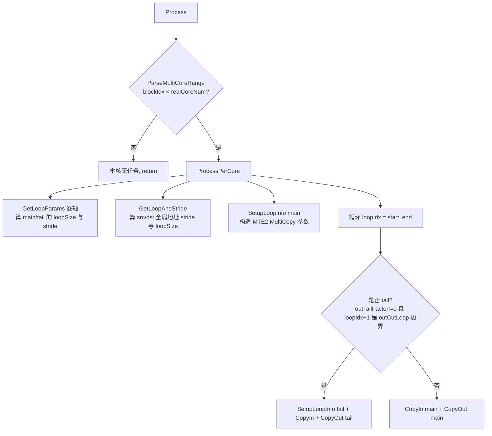

# Transpose 单轴切分策略 (CUT_ONCE) 性能调优参考

- 策略名:CUT_ONCE(单轴切分)
- tilingKey:`10002`
- kernel 实现:`transpose_cut_one_axis.h`,类 `TransposeCutOneAxis<T>`
- 派发入口:`transpose_kernel.cpp`(`tilingKey == CUT_ONCE`)
- host 选择逻辑:`transpose_tiling.cpp`(`DoSplitUB` / `CalcBlockSplitInfoForCutOnce` / `CalcInUbShapeInfoForCutOnce`)

本文面向性能调优开发者,描述 CUT_ONCE 在什么场景下被选中、为何能提升性能,以及 kernel 侧的执行流程与关键实现。所有结论以上述源码为准。

---

## 一、适用场景

### 1. Transpose 为什么要切分 UB

Transpose(转置/permute)本质是把输入按 `perm` 重排到输出,只搬字节、不做算术。arch35 的 NDDMA 家族用一次 `DataCopy`(MTE2,支持多维 stride 的搬入)把一块数据搬进 UB,再用 `DataCopyPad`(MTE3)按目标布局搬出,从而在一次 in/out 中完成维度重排。

问题在于 UB 容量有限:整块 shape 通常放不下。因此 host 侧需要沿某些轴做切分,让每次进 UB 的 tile 既能放下、又能让多核充分并行。切分策略的核心矛盾就是 **UB 容量 vs shape 大小**。

### 2. host 侧如何切分并区分 CUT_ONCE / CUT_TWICE

NDDMA 家族(`KEY_NDDMA_BASE` 分支)在 `CalcUBSplitInfo` 里先把 UB 可容纳的元素数开平方作为输入侧的初始预算:

```cpp
splitInfo_.inUbElement = sqrt(splitInfo_.ubElement);
DoSplitUB();
```

`DoSplitUB` 分两步:

1. `DoSplitUBInput()`:从输入最内轴往外走,能整轴放下就整轴吃掉、更新剩余预算;放不下的那一轴成为 **输入切分轴 `inCutIndex`**,并确定 `inUbFactor`(该轴每次进 UB 的份数)、`inTailFactor`(尾块)。剩余 UB 预算 `outUbElement = ubElement / inUbActual` 留给输出侧。
2. 沿输出轴(按 `reducedPerm` 从内往外)继续切,选出 **输出切分轴 `outCutIndex`** 与 `outUbFactor`,同时兼顾多核数量(`coreNum_`)。

关键的策略判定在 `DoSplitUB` 末尾:

```cpp
if (splitInfo_.outCutIndex > FindOutIndex(splitInfo_.inCutIndex)) {
    tilingKey_ = KEY_CUT_TWICE;   // 10003
} else {
    tilingKey_ = KEY_CUT_ONCE;    // 10002
}
```

`FindOutIndex(inCutIndex)` 返回输入切分轴在输出(perm)序中的位置。含义:

- **CUT_ONCE(本策略)**:当输出侧需要切分的位置 `outCutIndex` 不比输入切分轴在输出序中的位置更靠外(`outCutIndex <= FindOutIndex(inCutIndex)`),说明**一根轴的切分即可同时满足输入与输出的 UB 约束**——输入切分轴投影到输出序上的那次切分,已经覆盖了输出侧需要的切分,无需在输出侧再引入独立的第二次切分。此时只需一次切分,数据在 UB 里是连续/规整的,搬入搬出的 loop 结构简单。
- **CUT_TWICE**:当 `outCutIndex > FindOutIndex(inCutIndex)`,输入和输出各自需要在不同的轴上切分,一次切分无法同时满足两侧,必须切两次(输入一次、输出一次),并额外处理 input-tail / output-tail / tail 三类边界(见 `GetIntervalInfoForCutTwice`),loop 与地址计算都更复杂。

### 3. 为什么 CUT_ONCE 能提升性能

- 只需单轴切分,`CalcInUbShapeInfoForCutOnce` 生成的 UB tile 布局规整,搬出时的 `DataCopyPad` loop 层级更浅(`CopyOut` 里的 `endIndex` 之后一般只剩少数几层 loop),MTE3 指令数少。
- 相比 CUT_TWICE 没有 input-tail/output-tail 的交叉边界组合,尾块处理只有一种(`outTailFactor`),分支简单、气泡少。
- `CalcBlockSplitInfoForCutOnce` 会在核数不足时(`outUbAxis < coreNum_`)回退调小 `outUbFactor` 以拆出更多可并行的块,尽量把 `VEC_CORE_USED_THRES_HOLD` 之上的多核利用率吃满,同时用 `UbOutOfBoundCheck` 保证不超 UB。

### 4. 多核块划分要点(`CalcBlockSplitInfoForCutOnce`)

- 若输入切分轴恰好就是输出切分轴对应的输入轴(`inCutIndex == reducedPerm[outCutIndex]`),把 `outUbFactor *= inUbFactor` 合并,尾块随之更新。
- 若 `outUbFactor` 已等于整轴长度,则改用 `FindOutIndex(inCutIndex)` 作为输出切分轴,`outUbFactor = inUbFactor`。
- 总并行块数 `outUbAxis = CeilDiv(outShape[outCutIndex], outUbFactor) * (outCutIndex 之前、perm<inCutIndex 的轴乘积)`,再交给 `SetRealCoreNumAndBlkFactor` 换算 `realCoreNum / blkFactor / blkTailFactor`。当块数不足核数时,从大到小回退 `outUbFactor` 找到满足多核阈值又不超 UB 的因子。

---

## 二、kernel 执行流程与关键实现

kernel 侧仅使用一块 UB 队列做 in→out 直通搬运,不含 vector 计算。核心类 `TransposeCutOneAxis<T>` 继承自 `TransposeBase<T>`。

### 1. 缓冲与队列

```cpp
TQueBind<QuePosition::VECIN, QuePosition::VECOUT, 1> vecQue_;  // depth = 1
GlobalTensor<T> inputGM_, outputGM_;
```

- 用 `TQueBind<VECIN, VECOUT, 1>`:同一块 UB 既作搬入(VECIN)又作搬出(VECOUT)的绑定队列,搬入 `EnQue` 后直接 `DeQue` 搬出,中间不做运算。
- 队列深度为 1,`InitBuffer(vecQue_, 1, tiling_->ubSize)` 只分配一块 buffer。**注意:本策略未开启 double buffer**(深度=1、buffer 数=1),`BUFFER_NUM=2` 常量在此 kernel 未被使用;流水靠 MTE2/MTE3 与队列同步驱动,而非双缓冲乒乓。

### 2. Init 流程

```cpp
Init(x, y, tilingData, pipe):
    blockIdx_ = GetBlockIdx();
    tiling_ = tilingData;
    ParseTilingData();                       // expandedOutputCutIndex_ = outCutIndex + 5 - permSize
    inputGM_.SetGlobalBuffer(x);
    outputGM_.SetGlobalBuffer(y);
    pipe->InitBuffer(vecQue_, 1, tiling_->ubSize);
```

`ParseTilingData` 把 host 的 `outCutIndex` 映射到 NDDMA 固定 5 维(`NDDMA_MAX_DIM_NUM=5`)展开后的下标 `expandedOutputCutIndex_`(host 侧对不足 5 维的 shape 做了右对齐扩展,见 `NDDMADimExpand`)。

### 3. Process / ProcessPerCore 流程



- **多核范围** `ParseMultiCoreRange`(基类):由 `blkFactor / blkTailFactor` 计算本核负责的 `[blkProcessIdxStart_, blkProcessIdxEnd_)`。前 `blkTailFactor` 个核多分 1 个块,做到负载均衡;`blockIdx >= realCoreNum` 的核直接返回。
- **loop 参数** `GetLoopParams` 逐轴(reverse 下标)填 `loopSizeMain_/loopSizeTail_` 及 `loopSrcStrideMain_/loopDstStrideMain_`。在输出切分轴对应位置(`n == NDDMA_MAX_DIM_NUM - expandedOutputCutIndex_`)对 src stride 做 32B(`BLOCK_SIZE_BYTE`)对齐(`CeilAlign`),保证 UB 内每行按 block 对齐。
- **地址 stride** `GetLoopAndStride` 用 `expandedInputShape/expandedOutputShape` 反推各维全局 stride,并在切分轴上乘 `outUbFactor` 得到块间步长;`srcLoopSize_/dstLoopSize_` 是各维的块数(`CeilDiv(shape, ubShape)`),供混合进制地址换算使用。

### 4. 搬入 CopyIn(MTE2, NDDMA DataCopy)

```cpp
CopyIn(loopIdx, params):
    DecimalToMixed(loopIdx, dstLoopSize_, dstAddressOffsetMixedBase_);   // 线性块号 -> 多维块坐标
    for i in 0..5:
        srcAddressOffsetMixedBase_[perm[i]] = dstAddressOffsetMixedBase_[i];
        srcAddressOffset += ... * srcLoopStride_[perm[i]];               // 按 perm 反查输入地址
    localIn = vecQue_.AllocTensor();
    DataCopy<T, 5, config>(localIn, inputGM_[srcAddressOffset], params); // 多维 stride 搬入
    vecQue_.EnQue(localIn);
```

- `DecimalToMixed` 把线性 `loopIdx` 按各维块数 `dstLoopSize_` 拆成混合进制的多维块坐标(输出视角)。
- 通过 `perm` 把输出块坐标映射回输入,累加得到输入起始地址 `srcAddressOffset`——**这一步就是转置:搬入即按输入布局取,搬出按输出布局写。**
- `DataCopy<T, 5, config>` 是 NDDMA 的多维搬运,`params`(`MultiCopyParams`)由 `SetupLoopInfo` 生成,携带每维 `loopSize / loopSrcStride / loopDstStride`。`SetupLoopInfo` 里对输出切分轴前一维的 dst stride 做 32B 对齐,并用 `expandedPerm` 把 dst stride 重排到输出序;最后 `reverseArray` 把 5 维数组翻转以匹配 NDDMA 的维序约定。

### 5. 搬出 CopyOut(MTE3, DataCopyPad + LoopMode)

```cpp
CopyOut(loopIdx, loopSize, loopSrcStride, loopDstStride):
    dstAddressOffset = Σ dstAddressOffsetMixedBase_[i] * dstLoopStride_[i];
    copyOutParams.blockLen = sizeof(T);
    // 从最内维累乘 blockLen,直到遇到 “被切分/不整轴” 的维 -> endIndex
    ... 设定 blockCount / dstStride ...
    // endIndex 之后剩余维用 LoopModeParams 的 loop1/loop2 承载
    localOut = vecQue_.DeQue();
    DataCopyPad(outputGM_[dstAddressOffset], localOut, copyOutParams);   // 带 pad 的多维搬出
    vecQue_.FreeTensor(localOut);
```

- 通过扫描 `expandedOutputShape[i] != inUbMainDstShape[i]` 找到第一处“非整轴”维 `endIndex`,把它之内的连续维合并成一次 `blockLen` 的连续搬出,`blockCount / dstStride` 描述次外层,更外层用 `LoopModeParams` 的 `loop1/loop2`(必要时再套一层 `loop4` 手动循环)承载。这样把多维搬出压成尽量少的 `DataCopyPad` 调用。
- `SetLoopModePara(..., UB_TO_OUT)` / `ResetLoopModePara` 成对使用,配置 MTE3 的多重循环搬运模式。
- CUT_ONCE 因为只切一轴,`endIndex` 之后残余维通常很少,`DataCopyPad` loop 层级浅,MTE3 效率高。

### 6. main / tail 分流

`ProcessPerCore` 主循环里:

```cpp
outCutLoopSize = CeilDiv(expandedOutputShape[expandedOutputCutIndex_], outUbFactor);
if (outTailFactor != 0 && (loopIdx + 1) % outCutLoopSize == 0)  // 该切分轴的最后一块 -> tail
    CopyIn(paramsTail); CopyOut(tail);
else
    CopyIn(paramsMain); CopyOut(main);
```

切分轴无法整除时,每一轮切分的最后一个块用 tail 参数(`inUbTailSrcShape/inUbTailDstShape` + `loopSizeTail_` 等),其余用 main 参数。CUT_ONCE 只有这一种尾块分支,不像 CUT_TWICE 需要 input-tail/output-tail/tail 四类组合。

---

## 关键技术小结

| 技术点 | 是否使用 | 说明 |
|---|---|---|
| 多核切分 `ParseMultiCoreRange` | 是 | 按 `blkFactor/blkTailFactor` 均衡分块 |
| `TQueBind<VECIN,VECOUT,1>` | 是 | in→out 直通,单块 buffer,无运算 |
| double buffer | 否 | 队列深度=1,未开启乒乓双缓冲 |
| NDDMA `DataCopy`(MTE2) | 是 | 多维 stride 搬入,搬入即完成 perm 取址 |
| `DataCopyPad` + LoopMode(MTE3) | 是 | 多维带 pad 搬出,loop 层级浅 |
| 混合进制地址换算 `DecimalToMixed` | 是 | 线性块号 → 多维块坐标 → 经 perm 反查输入地址 |
| 32B 对齐(`CeilAlign`/`BLOCK_SIZE_BYTE`) | 是 | UB 内行按 block 对齐,保证搬运效率 |

调优时重点关注:切分轴选择是否让 `outUbFactor` 足够大以摊薄 MTE3 开销、同时块数是否达到 `realCoreNum` 以吃满多核;当 shape 使得输入/输出需在不同轴切分时会退化为 CUT_TWICE,此时 loop 与尾块开销更高。
