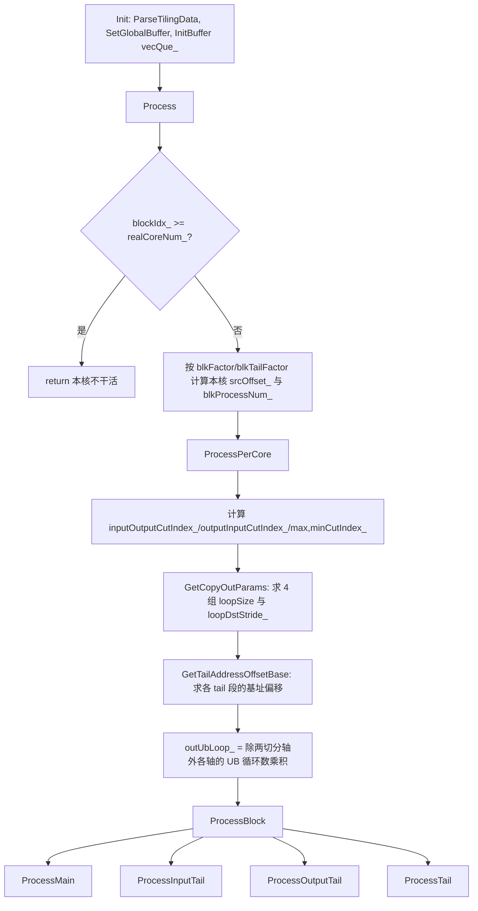
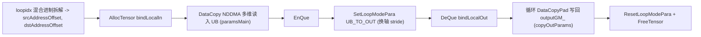

# Transpose 双轴切分策略 CUT_TWICE(tilingKey = 10003)

> 本文面向性能调优开发者,基于 arch35 `TransposeCutTwoAxis`(`transpose_cut_two_axis.h`,781 行)与 host 侧 `transpose_tiling.cpp` 的实际实现整理,不含臆测。
>
> - kernel 类:`Transpose::TransposeCutTwoAxis<T>`
> - 派发:`transpose_kernel.cpp` 中 `tilingKey == CUT_TWICE(10003)`
> - host 选择:`DoSplitUB()`(NDDMA 家族),block 切分 `CalcBlockSplitInfoForCutTwice()`,区间 `GetIntervalInfoForCutTwice()`
> - 数据结构:`TransposeOpTilingData`(`transpose_tiling_data.h`)

CUT_TWICE 属于 NDDMA(N 维 DMA)Transpose 家族。该家族先把逻辑 shape 归约(reduce)、再对齐扩展到固定的 5 维(`NDDMA_MAX_DIM_NUM = 5`),然后依据 UB 容纳能力在**输入方向和输出方向各切一根轴**来搬运并完成转置。

---

## 一、适用场景

### 1.1 为什么要在输入、输出两个方向都切分

Transpose 的本质是「一次搬运 + 换轴写回」。NDDMA 方案把一块数据读进 UB(`DataCopy`,按 `expandedInputShape` 的顺序线性读入),再按目标 perm 的顺序写回 GM(`DataCopyPad` + LoopMode 的多维 stride)。要让搬运高效,进 UB 的这一块必须满足两个约束:

1. **UB 容量约束**:一块的元素数不能超过 `ubElement`(UB 可用元素数)。
2. **搬出连续度约束**:写回时最内层要尽量凑满一个 cache line / block(32B),否则出现大量小碎片写。

host 侧 `DoSplitUB()` 的做法是:

- `DoSplitUBInput()`:先把 `inUbElement` 设为 `sqrt(ubElement)`(见 `CalcUBSplitInfo` 中 `KEY_NDDMA_BASE` 分支),从**输入最内轴**往外找到第一根装不下的轴,把它作为 `inCutIndex`,切分因子 `inUbFactor`。这保证了「读入方向」的连续块大小合适。
- 随后在 `DoSplitUB()` 里从**输出最内轴**往外扫,给「写出方向」找一根切分轴 `outCutIndex`、因子 `outUbFactor`,保证写回时每块也不越界、且尽量对齐。

问题在于:输入切的那根轴,在输出的轴序里处于某个位置 `FindOutIndex(inCutIndex)`;输出切的那根轴是 `outCutIndex`。如果这两者不是同一根轴,单切一根轴无法同时满足「读连续」和「写连续/不越界」——**读方向切好了,写方向仍然有一根大轴撑爆 UB 或产生极碎的写**。此时必须两个方向各切一根。

### 1.2 相对 CUT_ONCE,何时必须用双轴切分

判定就在 `DoSplitUB()` 结尾一行:

```cpp
if (splitInfo_.outCutIndex > FindOutIndex(splitInfo_.inCutIndex)) {
    tilingKey_ = KEY_CUT_TWICE;   // 10003
} else {
    tilingKey_ = KEY_CUT_ONCE;    // 10002
}
```

含义:

- `FindOutIndex(inCutIndex)` 是「输入切分轴」映射到输出轴序中的位置。
- 若为满足 UB 约束而选出的输出切分轴 `outCutIndex`,其位置比输入切分轴在输出里的位置**更靠外(下标更大 = 更外层)**,说明:仅靠切分输入轴对应的那根输出轴还不够,还得再往外切一根独立的输出轴才能把一块塞进 UB。这时才是真正的「双轴」。
- 反之(`outCutIndex <= FindOutIndex(inCutIndex)`),输入切分轴对应的输出轴自己就够用,单轴切分(CUT_ONCE)即可,`CalcBlockSplitInfoForCutOnce()` 里甚至会把 `outCutIndex` 直接回退到 `FindOutIndex(inCutIndex)`。

典型触发场景:高维、perm 把「大内轴」换到外侧的转置(例如 `[N, H, W, C]` 的复杂重排),单方向切分无法兼顾读写两端的块大小时,双轴切分能把 UB 一块限制在既读连续又写不越界的范围内。

### 1.3 为什么能提升性能

- **两端都可控**:输入方向的块保证 `DataCopy` 读入的连续度;输出方向的块保证 `DataCopyPad` 写回时 `blockLen/blockCount/dstStride` 合理,减少小于 cache line 的碎片写。
- **多核利用率**:`CalcBlockSplitInfoForCutTwice()` 会用 `outAxiseExceptSplitInAxis * inUbAxis` 估算并行度,若低于 `coreNum_`,则回头在 `inUbFactor` 上从大到小搜索,直到并行度达到 `VEC_CORE_USED_THRES_HOLD` 阈值且不越界(`UbOutOfBoundCheck`)。即在「块足够大」和「核用满」之间取平衡。
- **NDDMA 一次成型**:借助 5 维 `MultiCopyParams` + LoopMode,一次 API 调用即可完成多维带 stride 的搬运,免去逐轴显式循环拷贝的开销。

---

## 二、kernel 执行流程与关键实现

### 2.1 整体结构



### 2.2 Init

```cpp
blockIdx_ = GetBlockIdx();
ParseTilingData();                          // 算 expandedInput/OutputCutIndex_
inputGM_.SetGlobalBuffer((__gm__ T*)x);
outputGM_.SetGlobalBuffer((__gm__ T*)y);
pipe->InitBuffer(vecQue_, 1, tiling_->ubSize);   // 单块 buffer(深度 1)
```

`ParseTilingData()` 把 host 给的 `inCutIndex/outCutIndex`(基于归约后的 dim)平移到 5 维扩展坐标系:

```cpp
expandedOutputCutIndex_ = outCutIndex + NDDMA_MAX_DIM_NUM - permSize;
expandedInputCutIndex_  = inCutIndex  + NDDMA_MAX_DIM_NUM - permSize;
```

### 2.3 多核切分(Process)

按 `blkFactor_ / blkTailFactor_` 把「总 NDDMA 块数」平均分到 `realCoreNum_` 个核。前 `blkTailFactor` 个核各多处理一块。得到本核处理区间 `[srcOffset_, srcOffset_ + blkProcessNum_ - 1]`。这里的「块索引」是一维扁平编号,后面通过混合进制还原成多维偏移。

### 2.4 四个数据区间:main / inputTail / outputTail / tail

因为**同时切了两根轴**,每根轴都可能有尾块(`inTailFactor`、`outTailFactor`),两两组合出 4 类块:

| 区间 | 含义 | 处理函数 | 使用的 UB shape |
|------|------|----------|-----------------|
| main | 两轴都取满 factor 的主体块 | `ProcessMain` | `inUbMainSrc/DstShape` |
| inputTail | 输入切分轴取尾、输出轴取满 | `ProcessInputTail` | `inUbInputTailSrc/DstShape` |
| outputTail | 输出切分轴取尾、输入轴取满 | `ProcessOutputTail` | `inUbOutputTailSrc/DstShape` |
| tail | 两轴都取尾(尾中之尾) | `ProcessTail` | `inUbTailSrc/DstShape` |

区间边界由 host `GetIntervalInfoForCutTwice()` 预先算好,放进 tiling 的 `rangeMainEnd / rangeInputTailStart.. / rangeTailStart..`。只有当 `inTailFactor`、`outTailFactor` 非 0 时对应尾区间才存在(host 里有三种组合分支)。

kernel 侧 `ProcessBlock()` 用 `PorcessOffsetRange()` 把本核的 `[srcOffset_, ...]` 与四个全局区间求交,只对落在本核内的那部分区间调用对应 `Process*`:

```cpp
if (offsetRangeMainRes.end != 0 || blockIdx_ == 0) ProcessMain(...);
if (offsetRangeInputTailRes.end != 0)              ProcessInputTail(...);
if (offsetRangeOutputTailRes.end != 0)             ProcessOutputTail(...);
if (offsetRangeTailRes.end != 0)                   ProcessTail(...);
```

### 2.5 单块搬运的核心:Process* + SetupLoopInfo

四个 `Process*` 结构完全一致,区别只在用哪套 UB shape 和基址偏移。以 `ProcessMain` 为例,单块流程:



关键点:

1. **地址还原(混合进制)**:一维 `loopidx` 通过 `DecimalToMixedBase(loopidx, loopNumArray, mixedBase)` 拆成各外层轴的循环下标,再乘以每轴的 `loopShapeSizeArray`(shape size)累加成 GM 上的 `srcAddressOffset`/`dstAddressOffset`。`GetLoopAddressOffsetImpl` 负责挑出「除切分轴外、循环数 >1」的轴,src 用原轴序、dst 通过 `FindPermIndex` 用 perm 后的轴序,从而实现读写两端各自的地址步进。tail 段还会减去前面区间已消费的块数偏移(如 `ProcessInputTail` / `ProcessTail` 里那串 `loopidx - (...)`),并加上 `GetTailAddressOffsetBase()` 算出的尾块基址。

2. **读入:NDDMA `DataCopy`**
   ```cpp
   DataCopy<T, NDDMA_MAX_DIM_NUM, config>(bindLocalIn, inputGM_[srcAddressOffset], paramsMain);
   ```
   `paramsMain = {loopInfoMain, constValue}`,`loopInfoMain` 由 `SetupLoopInfo(inUbSrcShape, inUbDstShape)` 生成:5 维的 `loopSize / loopSrcStride / loopDstStride`。其中:
   - `loopSrcStride` 按 `expandedInputShape` 的后缀连乘得到(输入连续读)。
   - `loopDstStride` 先按 `inUbDstShape` 后缀连乘,再在 `maxCutIndex_ - 1` 处做 32B 对齐(`BLOCK_SIZE_BYTE`),然后按 `expandedPerm` 重排到目标轴序——这是「换轴」发生的地方。
   - 三个数组最后 `reverseArray` 反转以适配 API 的维度顺序。

3. **写回:LoopMode + `DataCopyPad`**
   `GetCopyOutParams()` 预先把 UB→GM 的搬出拆成:内两维用 `DataCopyExtParams`(`blockLen = loopSize[0]*sizeof(T)`、`blockCount = loopSize[1]`、`dstStride = (loopDstStride_[1] - loopSize[0]) * sizeof(T)`),外两维用 `LoopModeParams`(loop1/loop2 的 size 与 src/dst stride),最外一维(`loopSize[4]`)在 kernel 里用显式 `for` + `DataCopyPad` 逐次搬出。`SetLoopModePara(loopParams, DataCopyMVType::UB_TO_OUT)` 设定换轴的两层循环,搬完 `ResetLoopModePara`。

`GetCopyOutParams()` 里对每根切分轴(`inUbMainDstShape[i] != expandedOutputShape[i]` 处)分段累计 `loopSize`,并按 32B 向上对齐算 `loopSrcStride[1]`,保证写回块头部对齐。

### 2.6 用到的关键技术(按代码实况)

- **TQueBind(VECIN+VECOUT)单缓冲**:`vecQue_` 类型是 `TQueBind<VECIN, VECOUT, 1>`,`InitBuffer(vecQue_, 1, ubSize)` 深度为 1。即**同一块 UB 空间既作输入又作输出,无 double buffer**(`BUFFER_NUM=2` 仅在基类常量中,本策略未用于 ping-pong)。同步靠 `EnQue`/`DeQue` 维持 MTE2→MTE3 的依赖。
- **NDDMA 5 维搬运**:`DataCopy<T, 5, config>` + `MultiCopyParams/MultiCopyLoopInfo`,一次完成多维带 stride 的读入;`config = {false,0,0,false}`。
- **LoopMode 搬出**:`SetLoopModePara / ResetLoopModePara` + `DataCopyPad`,以 `DataCopyMVType::UB_TO_OUT` 完成换轴写回,支持非对齐尾块 pad。
- **多核切分**:`blkFactor_/blkTailFactor_/realCoreNum_` 一维扁平分核,`PorcessOffsetRange` 做本核区间与四类块区间求交。
- **混合进制寻址**:`DecimalToMixedBase` 把扁平 `loopidx` 还原成多维坐标,是「不显式嵌套多层 for」而处理任意维搬运的关键手段。
- **32B 对齐**:`SetupLoopInfo` 与 `GetCopyOutParams` 中多处按 `BLOCK_SIZE_BYTE=32` 做 `CeilAlign`,保证 stride/块头对齐,避免非对齐访存降速。

---

## 附:关键 tiling 字段(TransposeOpTilingData)

| 字段 | 作用 |
|------|------|
| `inCutIndex / outCutIndex` | 输入、输出方向切分轴(归约后坐标) |
| `inUbFactor / outUbFactor` | 两轴的 UB 切分因子 |
| `inTailFactor / outTailFactor` | 两轴尾块大小(决定尾区间是否存在) |
| `realCoreNum / blkFactor / blkTailFactor` | 多核切分参数 |
| `expandedPerm / expandedInput/OutputShape` | 5 维扩展后的 perm 与 shape |
| `inUbMain/InputTail/OutputTail/Tail Src/DstShape` | 四类块各自的 UB src/dst 形状 |
| `rangeMainEnd / rangeInputTail* / rangeOutputTail* / rangeTail*` | 四个扁平块区间边界 |
