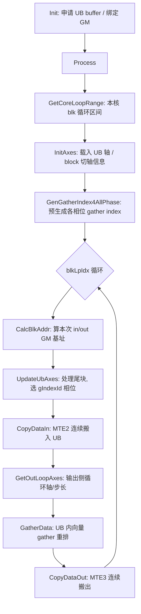

# Transpose 性能调优参考:GATHER_TRANSPOSE 策略

> 策略名:GATHER_TRANSPOSE(基于 gather 指令的转置)
> tilingKey:**10006**
> 硬件/编译要求:仅 `__NPU_ARCH__ == 3510`(dav-3510)可用,依赖 AscendC `MicroAPI` / `Reg` 寄存器编程模型,且必须打开编译宏 **`TRANSPOSE_ENABLE_GATHER`**。
> 关键实现文件:
> - kernel:`op_kernel/arch35/transpose_with_gather.h`(`Transpose::TransposeWithGather<T>`)
> - 派发入口:`op_kernel/transpose_kernel.cpp`
> - host 选择:`op_kernel/transpose_tiling.cpp`(`TryGatherTiling`)
> - gather 专用 tiling:`op_kernel/transpose_tiling_gather.{h,cpp}`(`TransWithGather::TransposeGatherTiling`)

---

## 一、适用场景

### 1.1 为什么用 gather 指令做转置

传统的 Transpose 在 Ascend 上通常依赖 NDDMA(带 stride 的 DMA 搬运)完成维度重排:数据按输出 perm 的顺序,通过多层带步长的 `DataCopy` 从 GM 搬入/搬出。当被转置的轴落在**最后一维**(last axis transpose)时,NDDMA 的搬运粒度会退化——输出最后一维在输入侧不连续,每个连续 burst 长度很短,MTE 通道被大量小 burst 和非连续 stride 拖累,带宽利用率低。

GATHER_TRANSPOSE 的思路是:把转置从"搬运时重排"改为"搬入后在 UB 内用向量 gather 重排":

1. 用一次尽量连续的 `DataCopyPad`(MTE2)把一个 UB 分块的数据整块搬入 UB,搬入布局尽量保证 burst 连续、MTE 效率高;
2. 在 UB 内用寄存器 gather 指令(`DataCopyGatherImpl` / `vgather`),按预先构造好的 index,一次性把输入布局按输出 perm 重排到输出 buffer;
3. 再用一次连续的 `DataCopyPad`(MTE3)把结果搬出。

这样把"非连续访问"的代价从昂贵的 DMA 通道转移到 UB 内的向量 gather 上,MTE2/MTE3 两端都走连续大 burst,显著提升带宽利用。

### 1.2 命中条件(什么 shape / perm 下选到)

host 侧选择逻辑见 `transpose_tiling.cpp::Run`,顺序为:VCONV → **gather** → NDDMA 兜底。gather 命中需要同时满足:

- 编译期打开 `TRANSPOSE_ENABLE_GATHER`(否则该分支整体被 `#if` 屏蔽,host 永远不产出 10006,统一由 NDDMA 覆盖);
- `shapeInfo_.isLastAxisTranspose == true`,即 `SetIsLastAxisTranspose()` 判定 **归约后 perm 的最后一维不等于 dim-1**(`reducedPerm[dim-1] != dim-1`),也就是最后一维参与了转置;
- `TransWithGather::DoTiling(...)` 返回成功(tiling 能算出合法的 UB / block 切分,详见下文的多处失败返回点)。

任何一步不满足就 fall through 到 NDDMA。注意 shape 在进入前已经过 `RemoveAxisV2`(去掉大小为 1 的轴)和 `MergeAxisV2`(合并连续可归约轴)。

### 1.3 tiling 层面的可行性约束(为什么有些 shape 命中不了)

`DoTiling` 内部有几个硬门槛,不满足即返回 false 交还 NDDMA:

- **MTE 搬入量下限**:`CalcUbAxesInfo` 要求单次搬入 UB 的字节数 `totalSizeInUb >= MTE_GATE`(`0x8000` = 32KB)。太小的分块用 gather 不划算。
- **Bank Conflict 规避**:`CheckBC(indexStep)` 检查 gather 的 index 步长按 sub-bank(8B)/ bank(128B)对齐后是否落在会产生 bank conflict 的位置,命中冲突则拒绝该切分。`CalcSqrtedTensor` 里也会因此把切分尺寸回退一个 sub-bank。
- **多核利用率**:`CalcBlockSplitInfo` 要求 `usedCoreCnt >= coreNum/2`,否则返回 false(核用不满不如走别的策略)。
- **借轴数量上限**:进 UB 参与重排的轴数受 `UB_MAX_BRW_NUM = 3` 限制(gather index 最多按 3 维构造)。

### 1.4 为什么需要硬件 / toolkit 支持

gather kernel 使用 AscendC 的 **MicroAPI(即 `Reg` 寄存器编程)** 模型:`RegTensor`、`MaskReg`、`MicroAPI::Arange/Div/Muls/Select/DataCopy`、以及核心的 `DataCopyGatherImpl`(向量 gather)。别名 `namespace MicroAPI = Reg` 仅在 `kernel_macros.h` 中 `__NPU_ARCH__ == 3510` 时定义,并通过 reg_compute 接口头暴露。因此:

- 只有 dav-3510 架构才有对应的向量 gather 硬件指令与 API;
- 旧 toolkit 缺 MicroAPI 别名会编译失败,所以整条路径用 `TRANSPOSE_ENABLE_GATHER`(默认 0)保护,构建可在无 MicroAPI 的 toolkit 上正常通过,只是不产出该策略。

---

## 二、kernel 执行流程与关键实现

### 2.1 整体流程



### 2.2 Init:buffer 与 double buffer

`Init`(`transpose_with_gather.h:115`)申请三块 UB:

```cpp
pipe->InitBuffer(xInQue_,  BUFFER_NUM, td_->dataTensorSize);  // VECIN
pipe->InitBuffer(xOutQue_, BUFFER_NUM, td_->dataTensorSize);  // VECOUT
pipe->InitBuffer(idxBuf_,  td_->indexTensorSize);             // VECCALC, gather index
idxLocal_ = idxBuf_.Get<RangeType_>();
```

- `BUFFER_NUM = 2`(见 `transpose_base.h`),即输入队列 `xInQue_` 与输出队列 `xOutQue_` 都是 **double buffer**,MTE2 搬入 / gather 计算 / MTE3 搬出通过 `TQue` 的 EnQue/DeQue 天然形成流水,搬运与计算 overlap。
- index buffer 是单块 `TBuf`(不需要 ping-pong,index 在 `Process` 前一次性生成后整个核复用)。
- `dataTensorSize` / `indexTensorSize` 由 host `CalcTensorSize` 按元素字节数(1B / 8B / 其它)和 ping-pong 份数从 UB 总量反推,保证 data(×2 ping-pong ×2 in/out)+ index 能放进 UB。

### 2.3 类型策略

kernel 用三个派生类型适配不同位宽(`transpose_with_gather.h:89`):

- `RangeType_`:index / arange 计算类型,`<=2B` 用 `int16_t`,否则 `int32_t`;
- `IdxType_`:传给 gather 的下标类型(对应无符号版本);
- `CastType_`:1B 元素(`int8/uint8`)在 gather 时按 16-bit 处理(gather 硬件粒度),搬出时再用 `StoreDist::DIST_PACK_B16` 打包回 8-bit。

`vlSize_` / `idxVLSize_` 由 `GetVRegSize()` 除以对应类型宽度得到,是一次向量指令处理的元素数。

### 2.4 gather index 的构造(核心)

index 表示"输出的每个元素来自输入 UB 内的哪个偏移"。构造在 `GenGatherIndex`(`:533`),按需要重排的维度数分派:

- `dimNum = ubAxesCnt - outUbOutCutPos`(即输出侧连续搬出的 cube 之外、需要 gather 的维度数),最多 3;
- `GenIndex4OneDim` / `GenIndex4TwoDim` / `GenIndex4ThreeDim` 分别对应 1/2/3 维重排。

以二维为例(`GenIndex4TwoDim`,输入 `(a,b,c,d)` → 输出 `(d,c,b,a)`,为 a、b 生成 index):

```
vec_a = VL % a            // Arange 后对 a 取模
vec_b = VL / a            // 除法得高维下标
index = vec_a * a_in_offset + vec_b * b_in_offset
```

超过一个向量长度(`idxVLSize_`)的部分,用增量 + 进位方式在循环里递推(避免每次重算除法):

```
vec_a += a_inc;  cmp_a = (vec_a >= a);  vec_a -= cmp_a * a   // Select 生成进位
vec_b += b_inc + cmp_a
```

三维版本 `GenIndex4ThreeDim` 同理再多一层进位链(a→b→c)。每维的 `*_in_offset` 由 `CalcUbAxesInOffset` 根据 UB 内轴布局算出(考虑 `DataCopyPad` 的块对齐:跨过 `inUbInCutPos` 时按 `elemPerBlock_` 向上对齐)。

#### 多相位 index(尾块处理)

`GenGatherIndex4AllPhase`(`:547`)在 Process 循环前**一次性生成多份 index**,因为分块循环里会出现"整块 / 输入方向尾块 / 输出方向尾块 / 双向尾块"四种尺寸组合。用 `gIdxOffset_`(按 block 对齐的每相位 index 长度)把不同相位的 index 依次排在 `idxBuf_` 里:

- 相位 0:满块;
- 相位 1:输入切轴尾块(`inUbTailFactor_ = inUbCutAxisSize % inUbCutAxisFactor`);
- 相位 2:输出切轴尾块(`outUbTailFactor_`);
- 相位 3:双向尾块。

具体生成哪几份取决于 host 给出的 `blkInUbCutPos` / `blkOutUbCutPos` 是否为 -1(即该方向是否真的被 block 切分且除不尽)。运行时 `UpdateUbAxes` 按当前 `blkLpIdx` 是否落在尾块上,置 `gIndexId_ ∈ {0,1,2,3}`;`GatherData` 里用 `idxAddr += gIndexId_ * gIdxOffset_` 直接选中对应相位的 index,无需重算。

### 2.5 GatherData:寄存器编程重排

核心循环(`transpose_with_gather.h:265`),运行在 `__VEC_SCOPE__` 内:

```cpp
idxAddr += gIndexId_ * gIdxOffset_;          // 选相位
for (lpIdx : burstLpCnt) {                   // 按向量长度分段
    mask = UpdateMask<T>(maskValue);
    MicroAPI::DataCopy(idxOriReg, idxAddr + lpIdx*vlSize_);   // 载入基准 index
    for (axis2Idx) for (axis1Idx) for (axis0Idx) {           // 输出侧外层循环
        idxUpdate = axis2*..+ axis1*..+ axis0*outUbAxis0InROffset_;
        MicroAPI::Adds(idxReg, idxOriReg, idxUpdate, maskIdx);  // 基准 index + 外层偏移
        DataCopyGatherImpl(xReg, xInAddr, idxReg, mask);        // 向量 gather
        MicroAPI::DataCopy(xOutAddr + outIdx*outLenAlign + lpIdx*vlSize_, xReg, mask);
    }
}
```

要点:

- **基准 index 复用**:一份 index(`idxOriReg`)描述最内层重排;输出侧的 axis0/1/2 外层循环只需给基准 index 加一个标量偏移 `idxUpdate`(`GetOutLoopAxes` 里算出的 `outUbAxisXInROffset_`),避免为每个外层组合都存一份 index,省 UB。
- **gather 指令** `DataCopyGatherImpl(dst_reg, base_addr, idx_reg, mask)`:以 `xInAddr` 为基址,按 `idxReg` 的每个元素做偏移取数到 `xReg`,mask 控制有效 lane。这是 dav-3510 特有的向量 gather 硬件能力。
- **1B 特殊路径**:`sizeof(T)==1` 时 gather 按 `CastType_`(16-bit)进行,写出用 `DataCopy<CastType_, StoreDist::DIST_PACK_B16>` 打包回 8-bit;`maskValue` 也相应 `*= sizeof(int16_t)`。

### 2.6 搬入 / 搬出(MTE 连续化)

- `CopyDataIn`(`:626`):`SetCopyInParams` 用 `DataCopyExtParams` + `LoopModeParams`(loop1/loop2 两层 stride 循环)配置带 stride 的 `DataCopyPad<T, PaddingMode::Compact>`,把一个分块整块搬入 UB。`inCube = CalcUbAxesInOffset(inUbInCutPos-1)*sizeof(T)` 是连续 burst 长度,`srcStride = axis0InSrcStride*sizeof(T) - inCube` 描述 GM 侧跳步;搬入 UB 侧按 block 对齐紧凑摆放(`Compact`)。
- `CopyDataOut`(`:676`):对称地用 `DataCopyPad` + loop mode 把 gather 结果搬出到 `yGM_[blkOutAddr_]`,`dstStride = axis0OutDstStride*sizeof(T) - outCube` 描述输出 GM 跳步。
- 搬入/搬出前后都成对调用 `SetLoopModePara` / `ResetLoopModePara`,方向分别为 `OUT_TO_UB` / `UB_TO_OUT`。

两端 burst 长度(inCube / outCube)都尽量做大且连续,把不连续代价集中到 UB 内 gather,这正是该策略的性能收益来源。

### 2.7 多核切分与地址计算

- **block 切分**(host `CalcBlockSplitInfo`):在 UB 分块之上,把剩余的 block 轴乘积 `totalElems` 均分到核。`usedCoreCnt = ceil(totalElems / ceil(totalElems/coreNum))`,`blkFactor` 为每核块数,最后一核用 `blkTailFactor`;要求 `usedCoreCnt >= coreNum/2` 否则放弃该策略。
- **本核区间**:`GetCoreLoopRange` 用 `blockIdx_ * blkFactor` 定起点,末核用尾 factor;`blockIdx_ >= usedCoreCnt` 的核直接 return(不参与)。
- **地址**:`CalcBlkAddr` 对每个 block 轴用 `idx / blkAxesOffset(i) % blkAxes[i]` 拆出下标,分别乘 `blkAxesInAOffset` / `blkAxesOutAOffset` 累加得到本次搬入/搬出的 GM 基址。

### 2.8 host tiling 关键概念对照

| host 概念 | 含义 |
| --- | --- |
| `inUbPerm_` / `outUbPerm_` | 从最内维往外挑选进 UB 参与重排的输入侧 / 输出侧轴(各 ≤ `UB_MAX_BRW_NUM=3`),挑到累计尺寸超过 `sqrtedTensor` 或达上限为止 |
| `sqrtedTensor` | `sqrt(elemInTensor)` 按 block / cacheLine 对齐,并做 BC 规避;用来平衡 in/out 两个方向的 UB 分块尺寸 |
| `inUbCutAxisFactor` / `outUbCutAxisFactor` | 输入 / 输出切轴的分块因子;`AdjustUbCutAxisFactor` 按 UB 是否溢出回调 |
| `ubPerm` / `inUbAxes` / `outUbAxes` | UB 内轴序与各轴大小,喂给 kernel 生成 index 与循环 |
| `axisXInSrcStride` / `axisXOutDstStride` | `CalcUbSplitInfo4MTE` 算出的 MTE 搬入/搬出多层 stride |
| `blkInUbCutPos` / `blkOutUbCutPos` | 该方向切轴是否被 block 切分且除不尽(决定尾块相位) |

---

## 调优提示

- 该策略专治"最后一维参与转置"且分块足够大(≥32KB)的场景;若命中不了,先确认 `TRANSPOSE_ENABLE_GATHER` 是否开启、是否在 dav-3510 上。
- index 步长若频繁触发 `CheckBC` 的 bank conflict,tiling 会缩小分块或直接放弃;shape 的最后一维大小与元素位宽是影响 BC 的主要因素。
- gather 相位是预生成的,尾块越多(切轴除不尽)index buffer 占用越大,可能挤压 data buffer 分块尺寸;规整的、能整除的分块尺寸更友好。
