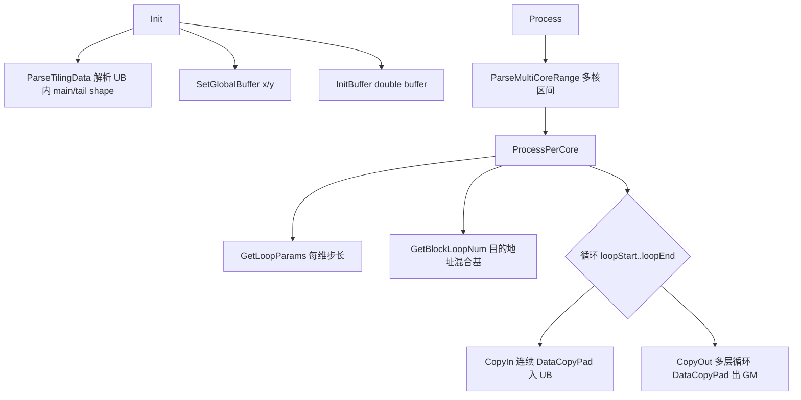

# Transpose 调优参考:N_LAST_TRANSPOSE(非末轴转置)

- 策略名:N_LAST_TRANSPOSE(kernel 类 `TransposeNLast`)
- tilingKey:10004
- kernel 实现:`arch35/transpose_n_last.h`
- 派发入口:`transpose_kernel.cpp`(`tilingKey == N_LAST_TRANSPOSE`)
- host 选择:`transpose_tiling.cpp::EntryTilingTemplate`

面向性能调优开发者。内容以代码为准,未使用的技术不做罗列。

---

## 一、适用场景

### 1. 什么是"末轴不参与转置"

对一个 `perm` 排列,若排列后的最后一维仍是原始最后一维,即 `reducedPerm[dim-1] == dim-1`,则称末轴不参与转置(non-last-axis transpose)。判定见 `SetIsLastAxisTranspose`:

```cpp
shapeInfo_.isLastAxisTranspose = shapeInfo_.reducedPerm[dim - 1] != dim - 1;
```

注意这里的 shape 与 perm 都是经过 `RemoveAxisV2`(去除大小为 1 的轴)和 `MergeAxisV2`(合并连续轴)化简后的结果。例如 `perm=[0,2,1,3]` 交换的是中间两维,末轴 3 保持在末尾,属于本策略场景;而 `perm=[0,2,3,1]` 把末轴挪走了,则不属于。

### 2. 为什么可以特殊优化(末轴连续搬运)

末轴不动意味着:输入中沿末轴连续的一段元素,在输出中依然是连续的一段。转置只发生在前面的高维之间,是"整块搬运 + 块的重新排布",而不需要在最内层做逐元素的跨步重排。

于是本策略把末轴(以及被切进 UB 的相邻高维)当作一个连续的数据块:

- 搬入(`CopyIn`)时以连续 `DataCopyPad` 把块从 GM 读进 UB;
- 搬出(`CopyOut`)时利用 `DataCopyPad` + `LoopModeParams` 的多层循环步长,把 UB 中的连续块按输出布局的目的地址步长写回 GM。

整个过程没有任何 Vector 计算,纯 DMA 搬运,末轴长度越大,单次搬运的连续 burst 越长,带宽利用率越高。

### 3. MOVEALIGN_LAST_MIN_ELE = 32 阈值的含义

选择条件见 `EntryTilingTemplate`:

```cpp
if (shapeInfo_.totalVolumeActual * shapeInfo_.eleLenInBytes >= SMALL_SHAPE_BYTES_THRES_HOLD) {
    if (!shapeInfo_.isLastAxisTranspose &&
        shapeInfo_.reducedInShape[shapeInfo_.dim - 1] >= MOVEALIGN_LAST_MIN_ELE) {  // 32
        tilingKey_ = KEY_N_LAST_TRANSPOSE;   // 10004
        return;
    }
    ...
}
```

即三个前提同时满足才选中本策略:

1. 总数据量足够大(`>= SMALL_SHAPE_BYTES_THRES_HOLD`),否则走 SMALL_SHAPE;
2. 末轴不参与转置(`!isLastAxisTranspose`);
3. 化简后末轴元素数 `reducedInShape[dim-1] >= 32`。

`MOVEALIGN_LAST_MIN_ELE = 32` 是末轴的最小元素数门槛。它的意义是保证连续搬运块足够长——只有末轴足够长,连续 `DataCopyPad` 才能摊薄每次搬运的固定开销、接近对齐搬运(move-align)的效率。若末轴太短(< 32),连续块太碎,move-align 带来的收益被非对齐尾块和搬运指令开销吃掉,此时改由 NDDMA 系列(`KEY_NDDMA_BASE` / `KEY_BIG_DIM`)处理更合适。

### 4. 为什么能提升性能

- 末轴连续,搬运粒度大,DMA burst 长,带宽利用率高;
- 无 Vector 计算,纯搬运,指令流简单;
- 目的地址的重排通过 `LoopModeParams` 的硬件多层循环步长一次配置、循环内复用完成,减少了逐块地址计算与指令发射开销。

---

## 二、kernel 执行流程与关键实现

### 1. 数据通路与 buffer

```cpp
TQueBind<QuePosition::VECIN, QuePosition::VECOUT, 1> vecQue_;
```

使用 `TQueBind` 把 VECIN 与 VECOUT 绑定为同一块 UB(搬入即搬出,中间无计算),配合 `BUFFER_NUM = 2` 的 double buffer:

```cpp
pipe->InitBuffer(vecQue_, BUFFER_NUM, tiling_->ubSize / BUFFER_NUM);
```

host 侧 `CalcUBSplitInfo` 对本策略把可用 UB 折半:

```cpp
case KEY_N_LAST_TRANSPOSE:
    splitInfo_.ubElement = ubSize_ / BUFFER_NUM / eleSize;
```

因此 double buffer 使搬入与搬出在两块 buffer 上流水重叠,掩盖 MTE 时延。

### 2. 多核切分

`Process` 先按 host 计算好的多核参数(`realCoreNum` / `blkFactor` / `blkTailFactor`)划分本核处理的循环区间:

```cpp
ParseMultiCoreRange(blockIdx_, realCoreNum, blkFactor, blkTailFactor,
                    blkProcessNum_, blkProcessIdxStart_, blkProcessIdxEnd_);
```

`blockIdx >= realCoreNum` 的核直接返回不做工。host 侧 `CalcBlockSplitInfoForNLastTranspose` 会在满足 UB 容量约束(`UbOutOfBoundCheckNLast`)与核利用率阈值(`VEC_CORE_USED_THRES_HOLD = 0.9`)之间选择 UB 切分因子 `inUbFactor` 和切分轴 `inCutIndex`,尽量让 `realCoreNum` 接近物理核数。

### 3. Init / Process 总体流程



### 4. 关键函数说明

**`ParseTilingData`**:根据 `inCutIndex` / `inUbFactor` / `inTailFactor` 展开 UB 内 main 块与 tail 块的输入 shape(`inUbInputShapeMain_/Tail_`),再按 `perm` 映射出对应的输出 shape。切分轴之后(更靠内)的维保留原大小,切分轴之前的维在 UB 内视作 1,切分轴本身取 factor。

**`GetLoopParams(n)`**:为搬出计算每层循环的 `loopSize`、源步长 `loopSrcStride`(基于末轴按 `BLOCK_SIZE_BYTE=32` 对齐后的 `alignedStride`)与目的步长 `loopDstStride`(沿输出 shape 累乘,直到遇到当前轴在 perm 中的位置)。main 与 tail 分别计算,避免热循环中判分支。

**`GetBlockLoopNum`**:用右侧维度累乘 `rightProducts` 构造目的地址的"混合基"`dstAddressOffsetMixedBase_` 和每维贡献 `dstLoopNumArray_`,供 `GetDstAddressOffset` 按 loopIdx 反解出 GM 目的偏移。

**`GetDstAddressOffset`**:把线性 `loopIdx` 按混合基逐位分解并直接累加成目的地址偏移,融合了"进制分解 + 累加",不落中间数组(见注释 P9)。

**`CopyIn`**:计算源地址偏移后,用 `DataCopyPad` 把一个 UB 块连续搬入。若末轴字节数按 32B 非整除,则退化为 `blockCount = blockLen / lastAxisLen` 的多 block 带 pad 搬入:

```cpp
copyInParams.blockLen = blockLen * sizeof(T);
copyInParams.blockCount = 1;
if ((lastAxisLen * sizeof(T)) % BLOCK_SIZE_BYTE != 0) {
    copyInParams.blockLen = lastAxisLen * sizeof(T);
    copyInParams.blockCount = blockLen / lastAxisLen;
}
```

**`CopyOut`**:核心搬出。先设 `copyOutParams`(以 `loopSize[0]` 为连续 burst,`loopSize[1]` 为 blockCount,`dstStride` 用输出步长表达跨行),再用 `SetLoopModePara(loopParams, DataCopyMVType::UB_TO_OUT)` 配置 loop1/loop2 两层硬件循环步长,然后在 loop4~loop7 四层软件循环里逐块 `DataCopyPad` 写回 GM:

```cpp
SetLoopModePara(loopParams, DataCopyMVType::UB_TO_OUT);
for (loop7) for (loop6) for (loop5) for (loop4)
    DataCopyPad(outputGM_[dst + ...], bindLocalOut[src + ...], copyOutParams);
ResetLoopModePara(DataCopyMVType::UB_TO_OUT);
```

即通过 "硬件 2 层循环(LoopMode)+ 软件 4 层循环 + copyParams 内 2 层" 组合覆盖最多 8 维的输出重排,而每个最内单元都是一次连续块的 move-align 搬运。

**`ProcessPerCore`**:预计算各维 `GetLoopParams` 与 `GetBlockLoopNum`,把 tiling 指针字段、成员数组缓存到栈上局部变量(注释 P1/P4/P6,避免结构体动态下标造成的别名污染与重复 Load),并将 main / tail 循环分离以消除热路径分支(注释 P2):

```cpp
for (loopIdx = loopStart; loopIdx < loopEnd; loopIdx++) {
    if (inTailFactor != 0 && (loopIdx + 1) % inCutLoopSize == 0) {
        CopyIn(...); CopyOut(..., loopSizeTail_, ...);   // 尾块
    } else {
        CopyIn(...); CopyOut(..., loopSizeMain_, ...);   // 主块
    }
}
```

### 5. 用到的关键技术小结

- Double buffer(`BUFFER_NUM=2`)+ `TQueBind`(VECIN/VECOUT 绑定同一 UB)实现搬入/搬出流水重叠,无中间计算。
- 连续 `DataCopyPad`:末轴连续,以长 burst 搬运;末轴非 32B 对齐时退化为多 block + pad。
- `SetLoopModePara` / `LoopModeParams`(`UB_TO_OUT`)硬件多层循环步长表达输出转置布局,循环外一次配置、循环内复用。
- 多核切分:host 侧按 0.9 核利用率阈值和 UB 容量约束选切分因子,kernel 侧 `ParseMultiCoreRange` 分配区间。
- 主/尾块循环分离、tiling 字段与成员数组栈缓存等标量优化,减少热路径分支与重复访存。

---

## 三、CopyOut 维度合并优化

> ⚠️ **实战经验**：N_LAST 的 CopyOut 按 **input 轴顺序**逐维循环，但 perm 会把 input 轴打散到 output 的不同位置。如果 output 中有相邻维度在 GM 中连续（C-order），可以将它们合并为更大的连续块，减少软件循环层数和 strided 写次数。实测在 batch_to_space 等高维 transpose 算子中，维度合并可将 CopyOut 从 6 维 6 循环降为 3 维 2 硬件循环，性能等价于连续写出。

### 1. 问题：循环顺序与 output 连续性不匹配

N_LAST 的循环按 input 轴从内到外排列（axis N-1, N-2, ..., 0），对应 `SimtComputeDim*` 的 `loopSize[n]` / `loopDstStride[n]`。但 perm 重排后，相邻的 input 轴在 output 中的位置不一定连续。

以 batch_to_space（perm=[2,3,0,4,1,5]）为例：

```
input 6D:  [bs0(0), bs1(1), N(2), H(3), W(4), C(5)]
output 6D: [N(0), H(1), bs0(2), W(3), bs1(4), C(5)]   (perm=[2,3,0,4,1,5])
```

N_LAST 循环顺序 vs output 位置：

| loop | input axis | output 位置 | 与下一 loop 在 output 中连续？ |
|------|-----------|------------|---------------------------|
| loop0 | bs0(0) | 2 | ✗ (下一 loop bs1 在 output 4) |
| loop1 | bs1(1) | 4 | ✗ (下一 loop N 在 output 0) |
| loop2 | N(2) | 0 | ✓ (H 在 output 1) |
| loop3 | H(3) | 1 | ✗ (W 在 output 3) |
| loop4 | W(4) | 3 | ✗ (C 在 output 5) |
| loop5 | C(5) | 5 | — |

5 个相邻关系中有 4 个不连续，导致 CopyOut 每层循环的 dstStride 有 gap（strided 写），每次 DataCopyPad 只搬末轴 C 个元素。

### 2. 维度合并算法

**核心思路**：检查 perm 逆映射，找出 output 中位置连续的 input 轴组，将同组维度合并为更大的连续块。

**步骤**：

1. 计算 perm 逆映射：`inv_perm[input_axis] = output_position`
2. 按 output 位置排序 input 轴
3. 找出 output 中位置连续的 input 轴组（`output_pos[i+1] == output_pos[i]+1`）
4. 合并同组维度：
   - 最内组的乘积作为新的 `blockLen`（连续 burst）
   - 次内组的乘积作为 `blockCount`（连续行数）
   - 更外组的乘积作为硬件循环的 `loopSize`（dstStride 连续，无 gap）

### 3. 合并示例（batch_to_space）

perm=[2,3,0,4,1,5] 的 output 全部相邻维度连续，可合并为 3 组：

```
output 6D: [N(0), H(1), bs0(2), W(3), bs1(4), C(5)]

连续组1: W(3) + bs1(4) + C(5) → 合并为 W*bs1*C 的连续块 (blockLen)
连续组2: H(1) + bs0(2)       → 合并为 H_cut*bs0 (硬件循环1, dstStride=W*bs1*C 连续)
连续组3: N(0)                → 硬件循环2, dstStride=H*bs0*W*bs1*C 连续)
```

**合并前后对比**：

| | 合并前（6 维 6 循环） | 合并后（3 维 2 硬件循环） |
|---|---|---|
| blockLen | C | **W*bs1*C**（连续） |
| blockCount | W, dstStride=bs1*C（strided） | 1 |
| 硬件循环1 | H_cut, dstStride=bs0*W*bs1*C | **H_cut*bs0**, dstStride=W*bs1*C（连续） |
| 硬件循环2 | N, dstStride=H*bs0*W*bs1*C | N, dstStride=H*bs0*W*bs1*C（连续） |
| 软件循环 | bs1 + bs0（2 层 strided） | **0 层** |
| DataCopyPad 次数 | bs0×bs1 次 strided | **1 次连续** |
| 所有 dstStride | 4/5 个有 gap | **0 个有 gap** |

合并后 CopyOut 变成 **1 次 DataCopyPad + 2 层硬件循环**，所有 stride 连续（无 gap），等价于直接连续写出整个 UB 块。

### 4. CopyIn 同理

CopyIn 的 `srcAddressOffset` 按 input 线性偏移计算，input 中相邻维度在 GM 中天然连续（C-order）。同样可以合并 input 中连续的维度组，增大单次 DataCopyPad 的 blockLen，减少搬运次数。

### 5. 通用判断条件

维度合并不是 batch_to_space 专用的——任何 N_LAST 适用场景都可以尝试：

1. **perm 不是完全逆序**（即 output 维度顺序与 input 不同），但部分维度在 output 中仍连续
2. **可合并维度数 ≥ 2**：至少有一对相邻维度在 output 中连续，合并后减少至少 1 层循环
3. **cut axis 不在最内组**：cut axis 需要单独成组（UB 切分约束），不能与更内维合并

**特殊情况**：
- 如果 perm 恒等（无转置），所有维度连续，合并后退化为 TENSOR_MOVE（1 次 DataCopyPad）
- 如果 perm 完全逆序，无连续维度，不能合并
- 大部分实际 transpose 的 perm 只有部分维度交换，至少有 1-2 组可合并

### 6. 实测数据参考

以 batch_to_space 算子（perm=[2,3,0,4,1,5]，6D）为例，在 ascend950 上：

| 实现 | CopyOut 方式 | case2 aiv(us) | case12 aiv(us) |
|------|------------|--------------|---------------|
| 基线 DataCopyPad | 4D 连续写出 | 19.4 | 24.6 |
| N_LAST（未合并） | 6 维 strided 写 | 58.9 | 124.1 |
| N_LAST（合并后预期） | 3 维连续写 | ~19 | ~25 |
| TQueBind 4D | 4D 连续写出 | 13.1 | 15.4 |

> N_LAST 未合并时比基线慢 2-5 倍，根因就是 CopyOut 的 strided 写。合并后预期与基线持平，因为 CopyOut 变为连续写出。TQueBind 更快是因为它在 4D 空间操作，天然利用了输出连续性，且 TilingData 更小（128B vs 972B）。

### 7. 实施建议

在 N_LAST 模板中增加维度合并逻辑的最佳位置：

- **Host 端**（`ComputeNLastTiling` / `ParseTilingData`）：在计算 `loopSize` / `loopDstStride` 之前，先检测可合并维度组，将合并后的维度组数和乘积写入 TilingData
- **Kernel 端**（`GetLoopParams` / `CopyOut`）：按合并后的维度组数设置循环参数，减少循环层数

**关键**：合并逻辑应作为 N_LAST 模板的通用增强，而非算子专用适配。通过检查 `inv_perm` 的连续性自动判断，无需 hardcode 特定 perm。
