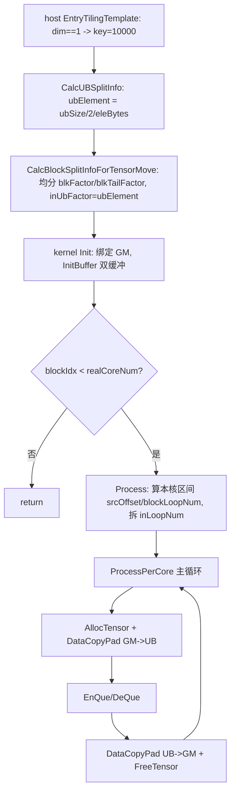

# Transpose 调优参考:TENSOR_MOVE 策略(tilingKey = 10000)

本文面向做 AscendC Transpose 算子性能调优的开发者,介绍 NDDMA 家族中最简单的一档策略 `TENSOR_MOVE`。

- 策略名:`TENSOR_MOVE`
- tilingKey:`10000`(host 侧常量 `KEY_TENSOR_MOVE`,kernel 侧宏 `#define TENSOR_MOVE 10000`)
- kernel 实现:`arch35/transpose_tensor_move.h`,类 `Transpose::TransposeTensorMove<T>`
- 基类:`arch35/transpose_base.h`,`TransposeBase<T>`
- 派发入口:`transpose_kernel.cpp`
- host 选择逻辑:`transpose_tiling.cpp`,`EntryTilingTemplate` / `CalcUBSplitInfo` / `CalcBlockSplitInfoForTensorMove`

---

## 一、适用场景

### 1. 它解决什么问题

`TENSOR_MOVE` 处理的是「本质上不需要做转置」的情况:输入经过 host 侧的轴规约后,实际只剩下**一个连续的数据轴**。这种情况下的 Transpose 退化为纯粹的按元素顺序拷贝(GM → UB → GM),没有任何维度重排,因此不需要 NDDMA 的多维搬运、也不需要 UB 内的转置计算。

为什么会退化成单轴?host 在 `Run` 中先后做了两步形状化简:

- `RemoveAxisV2`:删除所有值为 1 的轴(全 1 形状会被压成 `dim=1`)。
- `MergeAxisV2`:把 perm 中连续递增的相邻轴合并成一个轴。

对于「不改变数据物理排布」的 perm(例如恒等 perm `0,1,2...`,或所有非 1 轴在 perm 下仍保持连续升序),合并后 `shapeInfo_.dim` 会变成 1。此时输出的内存布局与输入完全一致,搬运即完成转置语义。

### 2. 被选中的 host 条件

选择发生在 `EntryTilingTemplate()`:

```cpp
void TransposeNddmaTiling::EntryTilingTemplate()
{
    SetIsLastAxisTranspose();
    splitInfo_.ubElement = ubSize_ / shapeInfo_.eleLenInBytes;
    if (shapeInfo_.dim == 1) {         // 规约合并后只剩一个轴
        tilingKey_ = KEY_TENSOR_MOVE;  // 10000
        return;
    }
    ...
}
```

判定极其简单:**只要化简后 `dim == 1`,就无条件选中 TENSOR_MOVE**,且早于 `SMALL_SHAPE / N_LAST / NDDMA / BIG_DIM` 等所有其他分支。这是最优先、最省事的一档。

需要注意选择的前提:该分支在 NDDMA 家族入口内,只有在前面的加速策略(VCONV 5hd、021 VCONV、可选的 GATHER)都未命中时才会走到。对单轴场景,那些加速策略也不会命中,所以最终稳定落在 TENSOR_MOVE。

### 3. 为什么能提升性能

- **零转置开销**:数据在 UB 里不做任何重排,只是「进 UB 再出 UB」,搬运即结果。相比走 NDDMA/多轴切分,省掉了 UB 内部的地址重映射与多维 DMA 描述符构造。
- **完全连续、对齐友好的 DMA**:单轴意味着源和目的都是连续地址,`DataCopyPad` 以大块 burst 搬运,带宽利用率高。
- **均衡的多核切分**:`CalcBlockSplitInfoForTensorMove` 把总元素数按核数均分,几乎打满所有核。
- **double buffer 掩盖搬入/搬出延迟**:见下文,MTE2(GM→UB)与 MTE3(UB→GM)通过 `TQueBind` 的双缓冲流水化,拷入与拷出可重叠。

对于「形状里带了很多 1、或 perm 实际不换数据」的常见退化 case,这一策略把 Transpose 变成接近理论带宽上限的 memcpy。

---

## 二、kernel 执行流程与关键实现

### 1. 数据结构与 buffer

```cpp
TQueBind<QuePosition::VECIN, QuePosition::VECOUT, 1> vecQue_;  // 进/出共用的绑定队列
GlobalTensor<T> inputGM_;
GlobalTensor<T> outputGM_;
DataCopyPadExtParams<T>  padParams_{false, 0, 0, 0};
DataCopyExtParams        copyOutParamsMain_{1, 0, 0, 0, 0};
```

关键点:

- 用的是 `TQueBind<VECIN, VECOUT, 1>`,把「输入队列」和「输出队列」绑成同一块 buffer。因为这里不做计算,同一块 UB 既作为搬入目的、又作为搬出源,`AllocTensor` 出来的 tensor 直接 `EnQue` / `DeQue` 后原样搬出即可。这样避免了额外的 VECIN→VECOUT 拷贝。
- `T` 为字节宽度类别(int8/int16/int32/int64),Transpose 只搬字节不做算术,fp16/bf16 归为 int16、fp32 归为 int32。

### 2. Init

```cpp
void Init(GM_ADDR x, GM_ADDR y, const TransposeOpTilingData* tilingData, TPipe* pipe)
{
    blockIdx_ = GetBlockIdx();
    tiling_ = tilingData;
    inputGM_.SetGlobalBuffer((__gm__ T*)x);
    outputGM_.SetGlobalBuffer((__gm__ T*)y);
    pipe->InitBuffer(vecQue_, BUFFER_NUM, tiling_->ubSize / BUFFER_NUM);
}
```

- 记录当前核 id,绑定输入/输出 GM。
- `InitBuffer(vecQue_, BUFFER_NUM, ubSize/BUFFER_NUM)`,`BUFFER_NUM = 2`,即**开启 double buffer**。注意 host 侧在 `CalcUBSplitInfo` 中已针对该 key 把可用 UB 元素数按 2 折半:

```cpp
case KEY_TENSOR_MOVE:
case KEY_N_LAST_TRANSPOSE:
    splitInfo_.ubElement = ubSize_ / BUFFER_NUM / shapeInfo_.eleLenInBytes;
```

`inUbFactor`(单次搬运元素数)最终就取自这个折半后的 `ubElement`(见 `CalcBlockSplitInfoForTensorMove`)。

### 3. 多核切分(host)

`CalcBlockSplitInfoForTensorMove` 按总元素数 `totalVolumeActual` 分核:

- 若总量小于核数:`realCoreNum_ = totalVolumeActual`,每核 1 个元素(`blkFactor=1`)。
- 否则:`realCoreNum_ = coreNum`,`blkFactor = total / coreNum`,余数放进 `blkTailFactor`,前 `blkTailFactor` 个核各多分 1 个元素(经典的均分 + 余数补齐)。
- 两种情况都令 `inUbFactor = ubElement`(UB 单次搬运的粒度)。

### 4. Process:每核确定自己的区间

```cpp
void Process()
{
    if (blockIdx_ >= tiling_->realCoreNum) { return; }   // 多余的核直接退出
    blockLoopNum_ = tiling_->blkFactor;
    srcOffset_    = blockIdx_ * tiling_->blkFactor;
    if (blockIdx_ < tiling_->blkTailFactor) {            // 前 blkTailFactor 个核多搬 1 个
        blockLoopNum_ += 1;
        srcOffset_    += blockIdx_;
    } else {
        srcOffset_    += tiling_->blkTailFactor;
    }
    inLoopNum_       = Ops::Base::CeilDiv(blockLoopNum_, tiling_->inUbFactor);  // UB 循环次数
    inputTailFactor_ = blockLoopNum_ % tiling_->inUbFactor;                     // 尾块元素数
    ProcessPerCore();
}
```

- 由 `blkFactor / blkTailFactor` 推出本核负责的元素总数 `blockLoopNum_` 和在 GM 上的起始偏移 `srcOffset_`。这段与基类 `ParseMultiCoreRange` 的逻辑一致(此处内联实现)。
- 再按 UB 单次容量 `inUbFactor` 把本核区间切成 `inLoopNum_` 次搬运,`inputTailFactor_` 为最后一块的余量。

### 5. ProcessPerCore:double buffer 搬运主循环

```cpp
void ProcessPerCore()
{
    int64_t copyNum = tiling_->inUbFactor;
    for (int64_t loopIdx = 0; loopIdx < inLoopNum_; loopIdx++) {
        if (loopIdx == inLoopNum_ - 1 && inputTailFactor_ != 0) {
            copyNum = inputTailFactor_;                       // 尾块用实际余量
        }
        copyOutParamsMain_.blockLen = copyNum * sizeof(T);    // 按字节数设置 burst 长度

        LocalTensor<T> bindLocalIn = vecQue_.AllocTensor<T>();
        DataCopyPad(bindLocalIn,
                    inputGM_[srcOffset_ + loopIdx * tiling_->inUbFactor],
                    copyOutParamsMain_, padParams_);          // GM -> UB (MTE2)
        vecQue_.EnQue(bindLocalIn);

        LocalTensor<T> bindLocalOut = vecQue_.DeQue<T>();
        DataCopyPad(outputGM_[srcOffset_ + loopIdx * tiling_->inUbFactor],
                    bindLocalOut, copyOutParamsMain_);        // UB -> GM (MTE3)
        vecQue_.FreeTensor(bindLocalOut);
    }
}
```

流程要点:

1. 每次循环 `AllocTensor` 拿一块 UB,`DataCopyPad` 从 GM 搬入(单块连续、`blockLen` 以字节计,`blockCount = 1`)。
2. `EnQue` / `DeQue` 完成同步语义:同一 tensor 搬入完成后立刻作为源搬出到 GM。
3. `FreeTensor` 归还 buffer。
4. 因为 `TQueBind` 深度为 `BUFFER_NUM = 2`,相邻两次循环的搬入(MTE2)与前一次的搬出(MTE3)可以在硬件上重叠,形成流水,掩盖单向 DMA 延迟。
5. 源/目的偏移完全相同(`srcOffset_ + loopIdx * inUbFactor`),再次印证这是「原位布局的纯拷贝」。

### 6. 执行流程图



### 7. 用到 / 未用到的关键技术

用到:

- **double buffer**:`InitBuffer(..., BUFFER_NUM=2, ...)` + `TQueBind` 深度 2,搬入搬出流水化。
- **TQueBind(VECIN+VECOUT 合一)**:进出共用一块 UB,免去中间拷贝。
- **`DataCopyPad`**:带 pad 参数的连续块搬运,`blockLen` 按字节设置,自动处理非 32B 对齐尾块。
- **多核均分切分**:host 侧按元素总数平均分核 + 余数补齐,尽量打满 `coreNum`。
- **字节宽度模板化**:按 1/2/4/8 字节分派,不区分具体 dtype。

未用到(区别于其他 Transpose 策略,便于对照理解):

- 没有 NDDMA 多维搬运 / `nddmaIdx`、`inUbMainSrcShape` 等描述符(那是 CUT_ONCE/CUT_TWICE/BIG_DIM 才用)。
- 没有 UB 内部转置、没有 regbase / MicroAPI(寄存器)编程(那是 GATHER_TRANSPOSE 路径)。
- 没有 VCONV / 5HD 相关搬运(那是 VCONV 系列)。
- 没有独立的 TBuf 临时空间,仅一个绑定队列。

---

## 小结

TENSOR_MOVE 是 Transpose 在「轴规约后退化为单轴、无需真正重排」时的快路径:host 一眼判定(`dim==1`),kernel 用双缓冲的连续 `DataCopyPad` 把数据 GM→UB→GM 原位搬过去,接近理论带宽。调优时若发现某个 Transpose case 命中 10000,通常说明该 case 已是最优形态,重点关注是否打满核数与 UB 单次搬运粒度即可。
