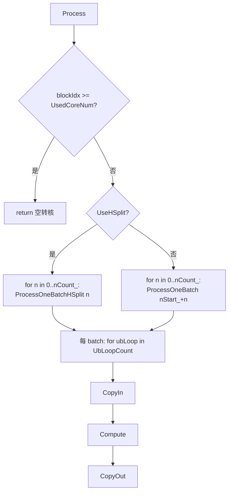

# Transpose 021 TransData 策略性能调优参考

- **策略名**:VCONV_021_TRANSPOSE / 021 TransData（基于 `TransDataTo5HD`）
- **tilingKey**:`10008`
- **支持数据类型宽度**:8-bit（int8/uint8）、16-bit（half/bfloat16）、32-bit（float/int32）
- **kernel 类**:`Transpose::KernelTransDataTo5HD021<T>`（`arch35/transpose_transdata_5hd_021.h`）
- **host tiling**:`transpose_host::Transpose021WithVCONV::DoTiling`（`transpose_tiling_021.cpp/.h`）
- **命中判定**:`TransposeNddmaTiling::Is021VConvValid`（`transpose_tiling.cpp`）

---

## 一、适用场景

### 1.1 什么是 021 转置

021 指 `perm = [0, 2, 1]`：把一个三维张量 `[N, H, W]` 变换为 `[N, W, H]`。
第 0 维（batch/N）保持不变，只交换后两维 H 与 W。它是标准的“逐 batch 的 2D 矩阵转置”，
每个 batch 内部就是一个 `H × W → W × H` 的转置，batch 之间彼此独立。

判定入口 `Is021VConvValid` 中的 perm 条件：

```cpp
// reducedPerm[0]==0 && reducedPerm[1]==2 && reducedPerm[2]==1
if (!(shapeInfo_.reducedPerm[0] == 0 &&
      shapeInfo_.reducedPerm[DIM_ONE] == VCONV_DIM_NUM /*=2*/ &&
      shapeInfo_.reducedPerm[DIM_TWO] == 1)) {
    return false;
}
```

### 1.2 为什么可以用 VCONV / TransData 加速

朴素的转置是“逐元素散射/聚集”式的搬运，DMA stride 极不友好，带宽利用率低。
昇腾提供了向量转置指令 `TransDataTo5HD`（俗称 VCONV / TransData），它在 UB 内一次性完成
一个 `16 × blockElem` 分块的转置：以 16 行为一组、按数据块（block）为列粒度做硬件转置，
把“逐元素搬运”变成“分块硬件转置 + 规整 DMA”，从而显著提升转置吞吐。

其中每次转置处理的行数固定为 `TRANSELEM_021 = 16`，列粒度 `blockElem` 随位宽变化（一个 32B block 内的元素数）：

```cpp
static constexpr int64_t blockElem = (sizeof(T) == 1) ? 32 :   // 8-bit
                                     (sizeof(T) == 4) ? 8  :   // 32-bit
                                                        16;    // 16-bit
```

### 1.3 与 5HD 策略（10007）的区别

| 项 | 5HD VCONV（tilingKey=10007） | 021 TransData（tilingKey=10008） |
|---|---|---|
| perm | 2D 末轴交换 `[1,0]` | 3D 保 batch `[0,2,1]` |
| 维度 | `dim == 2` | `dim == 3` |
| 支持位宽 | 仅 16-bit（派发处 `sizeof(T)==sizeof(int16_t)` 才实例化） | **8/16/32-bit 全支持** |

派发入口 `transpose_kernel.cpp`：

```cpp
} else if (tilingKey == VCONV_021_TRANSPOSE) { // 10008
    // 021 VCONV kernel supports 8/16/32-bit element widths.
    if constexpr (sizeof(T) == sizeof(int8_t) || sizeof(T) == sizeof(int16_t) ||
                  sizeof(T) == sizeof(int32_t)) {
        Transpose021VCONVTilingData lt; LoadTiling(tiling, lt);
        Transpose::KernelTransDataTo5HD021<T> op;
        op.Init(x, y, &lt, &pipe);
        op.Process();
    }
}
```

021 策略针对不同位宽在 kernel 内走了不同分支：8-bit 走 `Compute8BitCore`（奇偶行拆分 + high/low half 处理），
16/32-bit 走 `ComputeRConvGeneric` / `ComputeCConvGeneric`（32-bit 额外用 `dstStrideFactor=2` 处理跨 block）。

### 1.4 命中条件（`Is021VConvValid`）

除 perm=[0,2,1] 与 `dim==3` 外，还需同时满足：

- 位宽为 8 / 16 / 32-bit（`eleLenInBytes` ∈ {1,2,4}）。
- `H > 8` 且 `W > 8`（`DIM_EIGHT`），过滤掉极小边长。
- `H * W >= HW_MIN_PRODUCT`（转置面积下限）。
- 有效元素占对齐后面积比例不能太低：`H*W > hAlign*wAlign/2`（`hAlign/wAlign` 按 16 对齐），
  避免为凑对齐引入过多 padding 浪费。
- 总字节量 `totalVolumeActual * eleLenInBytes >= 70000`（`SMALL_SHAPE_BYTES_THRES_HOLD_DAV_5102_021`），
  小 shape 不走此路径（启动/搬运开销占比过高，收益不足）。

### 1.5 为什么能提升性能

- 用硬件向量转置指令替代逐元素搬运，UB 内转置吞吐高。
- CopyIn/CopyOut 均通过 `DataCopyPad` 做规整的分块 DMA，配合 stride 参数直接完成 gap/padding 处理。
- 多核按 batch（N）或按 H 切分并行，见 1.6。
- Double buffer（`BUFFER_NUM=2`）流水，搬入/计算/搬出重叠。
- 命中门槛（面积、字节量、对齐利用率）保证只在收益为正的 shape 上启用。

---

## 二、kernel 执行流程与关键实现

### 2.1 host tiling 关键决策（`transpose_tiling_021.cpp`）

`CalcBasicInfo` 计算基本量后有三个关键开关：

- **`UseRConv = (HLen >= WLen)`**：H 不小于 W 时以 “R（行/H）为转置主轴” 走 `ComputeRConv`；
  否则以 “C（列/W）为主轴” 走 `ComputeCConv`。目的是让 `repeatTimes` 落在较大的那一维，提高单次指令效率。
- **`UseHSplit`**：当 `NLen < 5 && !UseRConv && HLen >= NLen*16` 时启用“按 H 切分多核”，
  用于 batch 数很少、H 很大的场景把并行度提上去；注意 `CalcUbSplitHSplit` 中 8-bit 直接 `return false`（HSplit 不支持 8-bit）。
- **UB 切分**：`AvailableUbSize = ubSize/2/BUFFER_NUM`。分 `CalcUbSplitRConv` / `CalcUbSplitCConv` / `CalcUbSplitHSplit`：
  若整块 `HAlign*WAlign` 能放进 UB 则 `UbLoopCount=1`（不切分）；否则沿主轴切成多份 UB loop。
  若连一个 `TRANSELEM(16) × 对齐边` 都放不下，则 tiling 失败返回 false（回退其它策略）。

多核切分：非 HSplit 时 `CalcNSplitInfo` 按 N 均分（`NPerCore` + 尾核 `NTailCore`）；
HSplit 时 `CalcHSplitInfo` 按 H 对齐后均分（`HPerCore` + `HTailCore`）。`tilingKey` 固定写为 10008，`blockDim = UsedCoreNum`。

最终参数写入 `Transpose021VCONVTilingData`（含 `rUbSplitPara` / `cUbSplitPara` 两组 UB 切分因子）。

### 2.2 Init

```cpp
srcGlobal / dstGlobal 绑定 GM 输入输出;
if (UseHSplit) { 按 blockIdx 分配 hStart_/hCount_，nStart_=0, nCount_=NLen }
else           { 按 blockIdx 分配 nStart_/nCount_（区分整核/尾核） }
pipe->InitBuffer(inQueueSrc,  BUFFER_NUM, AvailableUbSize);
pipe->InitBuffer(outQueueDst, BUFFER_NUM, AvailableUbSize);
```

两条 TQue：`inQueueSrc`(VECIN) / `outQueueDst`(VECOUT)，各 `BUFFER_NUM=2` 块，形成 double buffer。

### 2.3 Process 主循环



`ProcessOneBatch` / `ProcessOneBatchHSplit` 内部按 `UbLoopCount` 循环，最后一次 loop 使用尾块因子
（`UbTailFactor` / `UbTailAlignFactor`），其余用整块因子（`UbFactor` / `UbAlignFactor`）。
每次 loop 都是 `CopyIn → Compute → CopyOut` 三段式，天然被 double buffer 流水化。

### 2.4 CopyIn：GM → UB

用 `DataCopyPad` + `DataCopyExtParams copyInParams_` 搬入。根据 W 是否对齐（`WLen % wAlignCheck`，
8-bit 检查 `blockElem`，其余检查 16）分两条路：

- **`CopyInWAligned`**:W 对齐时尽量整段搬（`blockCount=1`），或按行搬（`blockCount=actualValidRows`）设置行间 `srcStride`。
- **`CopyInWUnaligned`**:W 非对齐时逐行搬有效宽度 `validW`，用 `dstStride` 在 UB 内补齐到对齐宽度（`WAlignBlockElem`）。

`UseRConv` 时按 `rUbSplitPara` 偏移并计算 `actualValidRows`（防越界取 `min`）；否则按 `cUbSplitPara` 偏移。

### 2.5 Compute：UB 内 TransDataTo5HD 转置

`Compute` 按 `UseRConv` 分派到 `ComputeRConv` / `ComputeCConv`；两者再按位宽分派：

- **8-bit → `Compute8BitCore`**:关键在于 8-bit 一个 block 有 32 个元素而转置组只有 16 行，
  故把 32 行拆成 **偶数组 / 奇数组**（`evenUbCount`/`oddUbCount`），并借助 `srcHighHalf`（low/high half）
  两次遍历完成一个 `32-elem block` 的转置；组间用 `PipeBarrier<PIPE_V>()` 保证依赖顺序。
- **16-bit → `ComputeRConvGeneric` / `ComputeCConvGeneric`**:构造 `srcList[16]` / `dstList[16]` 地址表，
  设置 `repeatTimes / srcRepStride / dstRepStride` 后调用 `TransDataTo5HD<T>`，沿 `cAlign`（或 `rAlign`）循环。
- **32-bit → 同上 Generic 分支但走 `dstStrideFactor=2` 路径**:32-bit 一个 block 只有 8 个元素，
  转置目的地址需按 `dstStrideFactor` 拆成两半（`dstList[2k]` / `dstList[2k+1]` 分别指向 block 内前后段），
  正确处理 16 行跨两个 32-bit block 的排布。

`ComputeRConv` 与 `ComputeCConv` 的区别在于把 `repeatTimes` 放在 R 还是 C 方向，
以及 `srcRepStride/dstRepStride` 的取值（`repeatTimes==1` 时 stride 置 0）。

指令使用示意（16-bit Generic 分支）：

```cpp
TransDataTo5HDParams p;
p.repeatTimes  = r / TRANSELEM_021;                 // 16 行一组
p.dstRepStride = (p.repeatTimes == 1) ? 0 : dstStrideFactor;
p.srcRepStride = (p.repeatTimes == 1) ? 0 : cAlign * TRANSELEM_021;
for (j = 0; j < cAlign; j++) {
    for (i = 0; i < 16; i++) srcLocalList[i] = srcLocal[i*c + j*blockElem].GetPhyAddr();
    // 组装 dstLocalList[16] ...
    TransDataTo5HD<T>(dstLocalList, srcLocalList, p);
}
```

计算前 `DeQue<T>` 取输入、`AllocTensor<T>` 取输出，计算后 `EnQue` 输出并 `FreeTensor` 释放输入。

### 2.6 CopyOut：UB → GM

同样用 `DataCopyPad` + `copyOutParams_`，按 H、W 是否都对齐分 `CopyOutAligned` / `CopyOutUnaligned`：

- 转置后维度变为 `[W, H]`，故 `dstStride` 以 `HLen` 为行跨度回填 GM。
- `UseRConv` 与否影响 `blockCount/blockLen`（整段 vs 逐列），非对齐时用 `validLen/validCount` 裁掉 padding。
- HSplit 走独立的 `CopyInHSplit` / `CopyOutHSplit`，按 `hStart_` 定位 GM 的 H 段。

### 2.7 关键技术小结（均以代码为准）

- **`TransDataTo5HD` 向量转置指令**:16 行一组的硬件分块转置，是加速核心。
- **Double buffer**:`BUFFER_NUM=2`，`InitBuffer` 分配双缓冲，CopyIn/Compute/CopyOut 流水重叠。
- **TQue 管理**:`inQueueSrc`(VECIN) / `outQueueDst`(VECOUT)，`AllocTensor/EnQue/DeQue/FreeTensor` 生命周期管理。
- **`PipeBarrier<PIPE_V>()`**:仅在 8-bit 奇偶组/half 切换处插入，保证 vector 转置的写后读依赖。
- **R/C 主轴自适应**:`UseRConv = HLen>=WLen`，让 repeat 落在较长维度。
- **位宽自适应**:`blockElem`(32/16/8)、`dstStrideFactor`(32-bit=2) 按 `sizeof(T)` 编译期确定。
- **多核切分**:N 切分为主；batch 少而 H 大时切换 H 切分（HSplit，不支持 8-bit）。
- **`DataCopyPad` + stride**:搬运阶段直接处理对齐 gap 与 padding，避免额外 pad 计算指令。

> 注意:文中未出现的技术（如 MTE/L1 缓存、mask、reduce 等）本策略并未使用，请勿据此推断。
