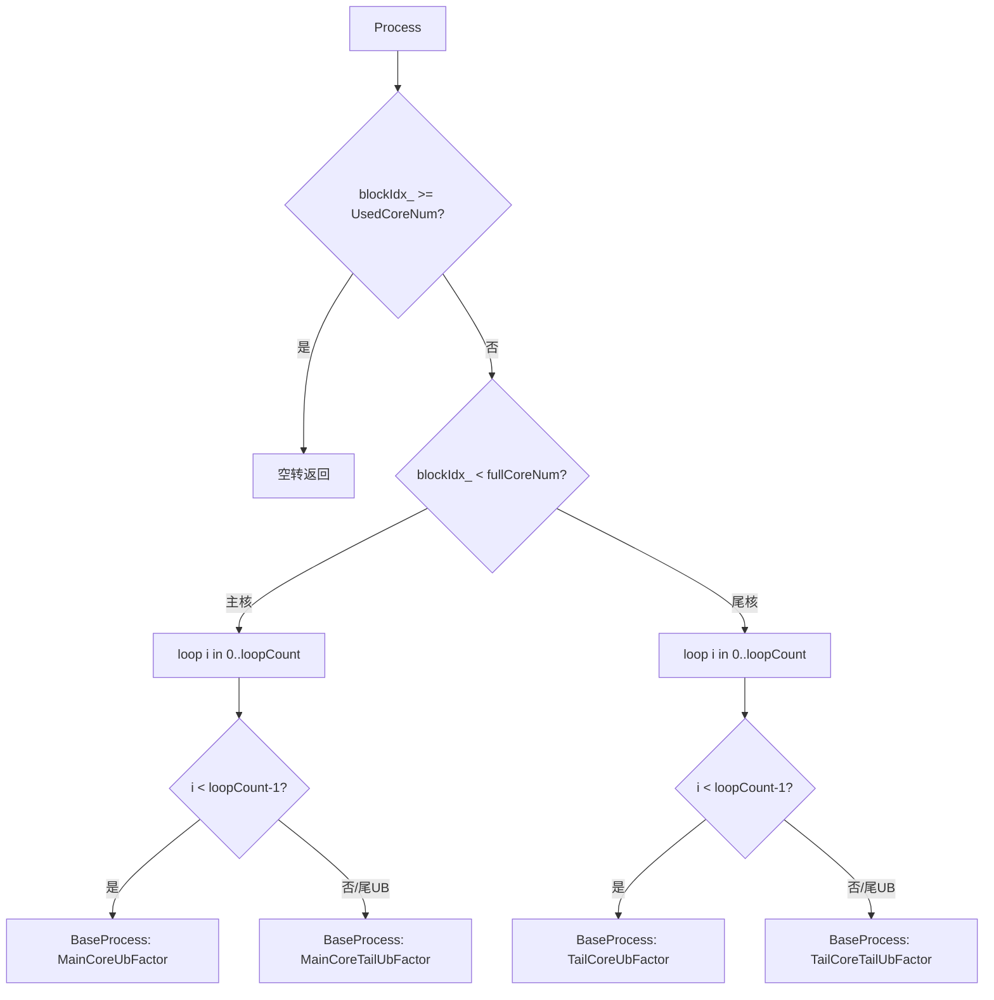

# Transpose 策略参考:VCONV_TRANSPOSE / 5HD TransData

- **策略名**:VCONV_TRANSPOSE(5HD TransData 向量转置)
- **tilingKey**:`10007`
- **kernel 类**:`Transpose::KernelTransDataTo5HD<T>`(`arch35/transpose_transdata_5hd.h`)
- **重要约束**:**仅支持 16bit 元素宽度**(`eleLenInBytes == 2`,如 fp16/bf16/int16)。派发处用 `if constexpr (sizeof(T) == sizeof(int16_t))` 保护;host 侧命中条件也强制 `eleLenInBytes == VCONV_DSIZE(=2)`。

---

## 一、适用场景

### 1.1 什么是 5HD / VCONV 转置

本策略把一次「二维矩阵转置」映射到 AscendC 的向量转置指令 `TransDataTo5HD` 上完成。`TransDataTo5HD` 原本用于 ND 与 5HD(NC1HWC0)之间的格式转换,其硬件本质是在 Vector 单元内对一个 **16 × 16 的元素块**做转置。由于每个 16bit 元素恰好让一个 block(32B)容纳 16 个元素,16×16 的方块转置可以被向量单元一条指令高效吞掉,因此把整块矩阵拆成若干 16×16 子块,逐块调用 `TransDataTo5HD` 即可完成整体转置。

相比走 DMA/NDDMA 的搬运式转置,VCONV 路径把转置计算放在片上 UB 中由 Vector 单元完成,搬入搬出都是**连续或规则跨步**的 `DataCopyPad`,避免了细粒度、非连续的 GM 随机访问,因此在命中场景下带宽利用率更高。

### 1.2 为什么 2D 末轴交换的 16bit 数据能用 VCONV 加速

- **16×16 块对齐天然契合 16bit**:`TransDataTo5HD` 一次处理 16 行 × 16 列。16bit 元素下,16 个元素 = 32B = 1 个 UB block,转置后的写出也天然对齐,无需额外的位宽拼接/拆分。这也是它只支持 16bit 的原因。
- **末轴交换 (perm=[1,0]) 即纯二维转置**:输入 `[R, C]` 输出 `[C, R]`,访问模式规整,能整齐地切成 16×16 网格。
- **性能收益来源**:
  - 转置在片上完成,GM 侧读写是大块连续搬运(`DataCopyPad` 带规则 stride),而非逐元素散读。
  - 借助 `TQue` 双缓冲(`BUFFER_NUM = 2`),搬入 / 计算 / 搬出三级流水互相掩盖。
  - 多核按 16 行/列块粒度均分,充分利用全部 AI Core。

### 1.3 命中条件(host 侧 `TryVCONVTiling`)

在 `transpose_tiling.cpp` 的 `TryVCONVTiling` 中,同时满足以下条件才进入本策略(`transpose_tiling_5hd.cpp` 的 `DoTiling`):

```cpp
shapeInfo_.reducedPerm[0] == 1 && shapeInfo_.reducedPerm[1] == 0 &&  // 二维末轴交换
shapeInfo_.dim == VCONV_DIM_NUM (== 2) &&                            // reduce 后为 2D
shapeInfo_.eleLenInBytes == VCONV_DSIZE (== 2) &&                    // 16bit
shapeInfo_.reducedInShape[0] > DIM_FIVE (> 5)                        // R 轴长度 > 5
```

即:经过 `RemoveAxisV2` / `MergeAxisV2` 归约后是一个二维、末轴交换、16bit、且 R(第 0 轴)长度大于 5 的转置。`R > 5` 用于排除过小的 shape(此类小 shape 交给通用路径更划算)。若 `DoTiling` 因 UB 放不下(见下文 `CalcRCNotFullLoadUbSplitInfo` 的失败分支)返回 false,则回退到其他策略。

---

## 二、Tiling 切分逻辑(host 侧)

记输入为 `[R=RLen, C=CLen]`。以下常量:`TRANSELEM = 16`(块边长),`BUFFER_NUM = 2`(双缓冲),`BUFFER_TENSOR_NUM = 2`(输入+输出各一块)。

### 2.1 基础信息 `CalcBasicInfo`

```cpp
AvailableUbSize = ubSize / BUFFER_TENSOR_NUM / BUFFER_NUM;   // 单块可用 UB (in/out 各一块、双 buffer)
RAlignBlock  = CeilDiv(RLen, 16);   RAlignBlockElem = RAlignBlock * 16;   // R 向上对齐到 16
CAlignBlock  = CeilDiv(CLen, 16);   CAlignBlockElem = CAlignBlock * 16;   // C 向上对齐到 16
```

即把 R、C 都向上对齐到 16 的倍数,按 16×16 块组织。

### 2.2 三种切分模式(`CalcBlockAndUbSplitInfo`)

按「哪一维能在 UB 内整列/整行放下」决定核间切分维与 UB 内切分维:

| 判断条件 | 核切分维 | UB 全载维 | 标志 |
|---|---|---|---|
| `16 * CAlignBlockElem * 2 <= AvailableUbSize` | R 轴切核 (`CalcRSplitInfo`) | C 全载 (`CalcCFullLoadRUbSplitInfo`) | `IsRSplit=true` |
| 否则若 `16 * RAlignBlockElem * 2 <= AvailableUbSize` | C 轴切核 (`CalcCSplitInfo`) | R 全载 (`CalcRFullLoadCUbSplitInfo`) | `IsRSplit=false` |
| 否则(两维都放不下一个 16 条带) | R 轴切核 | R、C 均需再切 (`CalcRCNotFullLoadUbSplitInfo`) | `IsRCSplit=true` |

- **R-split / C 全载**:一次处理若干整行(R 方向,16 的倍数),C 方向整列全载。若 `BlockFactor 行 × C 全载` 一次装不下 UB,则进一步按 `MainCoreUbFactor` 沿 R 分多个 UB 循环(`MainCoreLoopCount`)。
- **C-split / R 全载**:对称地,一次处理若干整列,R 全载,必要时沿 C 分 UB 循环。
- **RC 双切 (`IsRCSplit`)**:R、C 都装不下时,核间按 R 切,UB 内先固定 R 的 `BlockFactor`,再沿 C 用 `MainCoreUbFactor` 分块循环。若连 `BlockFactor(16行) × 16 × 2B` 都超过 `AvailableUbSize`,`CalcRCNotFullLoadUbSplitInfo` 返回 false,`DoTiling` 失败并回退到其它策略。

核间切分(`CalcRSplitInfo` / `CalcCSplitInfo`)以 16 对齐块为单位在 `coreNum` 个核间均分,得到主核 `BlockFactor` 与尾核 `BlockTailFactor`,`UsedCoreNum = BlockCount`。UB 内切分则用 `MainCore*` / `TailCore*` × (`Ub` / `TailUb`) 一套四组因子覆盖「主核/尾核 × 主UB循环/尾UB循环」的所有边界。这些因子最终由 `WriteTilingData` 写入 `TransposeVCONVTilingData`(结构见 `transpose_tiling_data.h`:`rSplitPara/cSplitPara` 为 `CoreSplitPara`,`rUbSplitPara/cUbSplitPara` 为 `UbSplitPara`)。

---

## 三、Kernel 执行流程与关键实现

### 3.1 Init

```cpp
blockIdx_   = GetBlockIdx();
fullCoreNum = UsedCoreNum - 1;                       // [0, fullCoreNum-1] 主核, 其余尾核
loopCount   = (blockIdx_ <= fullCoreNum-1) ? MainCoreLoopCount : TailCoreLoopCount;
isRsplit    = IsRSplit;   isRCSplit = IsRCSplit;
pipe->InitBuffer(inQueueSrc,  BUFFER_NUM, AvailableUbSize);   // VECIN 双缓冲
pipe->InitBuffer(outQueueDst, BUFFER_NUM, AvailableUbSize);   // VECOUT 双缓冲
```

用两条 `TQue`(`TPosition::VECIN` / `VECOUT`),各开 `BUFFER_NUM=2` 块,实现搬入/计算/搬出的 double buffer 流水。

### 3.2 Process 主循环



`Process` 依据「主核/尾核」× 「主 UB 循环/尾 UB 循环」四种组合,取对应的 `r/c/rAlign/cAlign` 因子,先 `SetBasePocessData` 算出本次的 GM/UB 偏移,再走 `BaseProcess`。多余核(`blockIdx_ >= UsedCoreNum`)直接返回。

### 3.3 BaseProcess:搬入 → 计算 → 搬出

```cpp
BaseProcess(process, r, c, rAlign, cAlign) {
    BaseCopyIn(process);              // DataCopyPad: GM -> inQueueSrc
    BaseCompute(r, c, rAlign, cAlign);// TransDataTo5HD 转置
    BaseCopyOut(process);             // DataCopyPad: outQueueDst -> GM
}
```

- **BaseCopyIn**:`AllocTensor` → `SetCopyInParams`(按 `isRCSplit/isRsplit/否` 分派为 `SetRCSplitCopyInParams` / `SetRSplitCopyInParams` / `SetCSplitCopyInParams`,分别设置 `blockCount / blockLen / srcStride`)→ `DataCopyPad(srcLocal, srcGlobal[gmOffset+copyInCoreOffset], Params, padParams)` → `EnQue`。注意 `SetRSplitCopyInParams` 对 `CLen % 16 == 0` 走单块连续搬运,否则按行 `blockCount` 搬运。
- **BaseCopyOut**:对称,`SetCopyOutParams` 分派设置写回的 `blockCount/blockLen/dstStride`,`DataCopyPad` 写回 `dstGlobal`。

### 3.4 核心计算:`TransDataTo5HD` 16×16 块转置

`BaseCompute` 按 `r >= c` 选择两条对称路径:

```cpp
if (r >= c) ComputeRConv(r, c, cAlign);   // 沿 C 方向循环转置
else        ComputeCConv(r, c, rAlign);   // 沿 R 方向循环转置
```

**`ComputeRConv`(r ≥ c)**关键实现:

```cpp
TransDataTo5HDParams p;
p.repeatTimes = r / 16;                                  // 一次处理 r/16 个 16 行块
p.dstRepStride = (p.repeatTimes == 1) ? 0 : 1;
p.srcRepStride = (p.repeatTimes == 1) ? 0 : cAlign * 16;
for (int j = 0; j < cAlign; j++) {                       // 沿列方向 16 列一组
    LocalTensor<T> srcLocalList[16], dstLocalList[16];
    for (int i = 0; i < 16; i++)
        srcLocalList[i] = srcLocal[i * c + j * 16];      // 源 16 行地址
    for (int i = 0; i < 16; i++)
        dstLocalList[i] = dstLocal[i * r + j * 16 * r];  // 目的地址(已转置布局)
    TransDataTo5HD(dstLocalList, srcLocalList, p);
}
```

- 每次 `TransDataTo5HD` 处理一个 16 列宽、`repeatTimes` 个 16 行块的条带,把该条带内每个 16×16 方块转置。`srcLocalList[16]` / `dstLocalList[16]` 是 16 个行指针(高低半 `dstHighHalf/srcHighHalf` 均 false)。
- `srcRepStride = cAlign*16` 让 repeat 在源上跳过整行对齐宽度;`dstRepStride = 1` 让转置结果落到目的的连续块位置。目的偏移 `i*r + j*16*r` 体现「转置后行列互换」的地址布局。
- `ComputeCConv` 与之对称(`repeatTimes = c/16`,`dstRepStride = rAlign*16`,`srcRepStride = 1`,外层沿 `rAlign` 循环)。选择 `r>=c` 与否是为了让 `repeatTimes` 取较大的那一维,减少外层循环次数、提升单条指令的吞吐。

计算完 `outQueueDst.EnQue(dstLocal)` 并 `inQueueSrc.FreeTensor(srcLocal)`,交回给 double buffer 流水。

### 3.5 关键技术小结

- **向量转置指令 `TransDataTo5HD`**:片上 16×16 块转置,是本策略性能核心;16bit 元素与 16-block 对齐是其使用前提。
- **16×16 分块 + 16 对齐**:R、C 向上对齐到 16,按块组织搬运与转置。
- **Double buffer**:`inQueueSrc` / `outQueueDst` 各 `BUFFER_NUM=2`,搬入/计算/搬出流水掩盖。
- **`TQue` (VECIN/VECOUT)** 管理 UB 张量生命周期(`AllocTensor/EnQue/DeQue/FreeTensor`)。
- **`DataCopyPad` 规则搬运**:配合 `CoreSplitPara/UbSplitPara` 的 stride 参数,GM 侧读写为大块规则搬运而非散读。
- **三种切分(RSplit / CSplit / RCSplit)** 覆盖 C 全载、R 全载、双切三类 UB 容量场景,主核/尾核 + 主UB/尾UB 因子处理所有边界。

---

## 附:tilingKey 与派发

`transpose_kernel.cpp` 中:

```cpp
} else if (tilingKey == VCONV_TRANSPOSE /* 10007 */) {
    if constexpr (sizeof(T) == sizeof(int16_t)) {          // 仅 16bit 实例化
        TransposeVCONVTilingData lt; LoadTiling(tiling, lt);
        Transpose::KernelTransDataTo5HD<T> op;
        op.Init(x, y, &lt, &pipe);
        op.Process();
    }
}
```

注意:tilingKey 10008 (`VCONV_021_TRANSPOSE`) 是相邻的 021 三维 VCONV 策略(支持 8/16/32bit),与本文的 10007 是不同 kernel(`KernelTransDataTo5HD021`),不要混淆。
